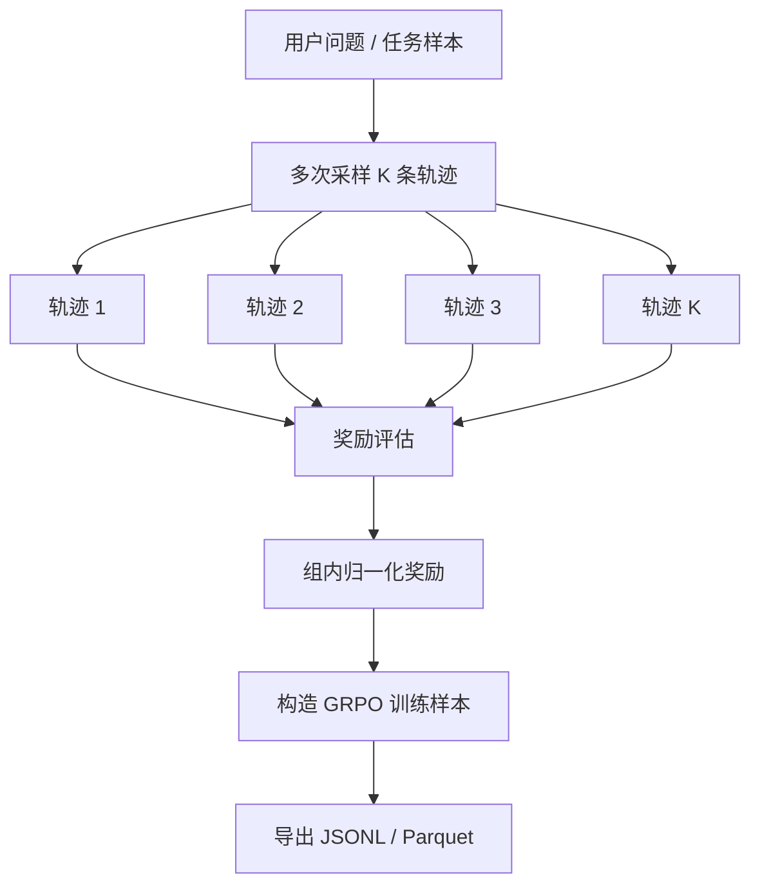

Optimized tool selection下面是一份适合当前多智能体系统的 **GRPO 强化学习采样框架设计方案**。目标不是立刻把所有模型训练跑起来，而是先提供一个可落地的脚本框架，用于：

- 对各个智能体进行多轮采样；
- 记录完整轨迹；
- 构造 GRPO 所需的 group rollouts；
- 计算相对奖励；
- 产出可用于后续训练的数据集。

---

## 1. 总体目标

设计一个脚本，例如：

```bash
python scripts/grpo_agent_framework.py sample --config configs/grpo.yaml
python scripts/grpo_agent_framework.py score --run-id xxx
python scripts/grpo_agent_framework.py export --run-id xxx
```

用于对当前健康管理多智能体系统做强化学习数据采集。

当前系统中的核心智能体可作为 GRPO 的采样对象：

| 智能体 | 作用 | 是否适合单独采样 |
|---|---|---|
| Context Manager / InfoManager | 管理上下文、个性化记忆 | 适合 |
| Planner | 制定工具调用与回答计划 | 非常适合 |
| Info Refiner | 提炼检索信息 | 适合 |
| Executor | 生成正式回答 | 非常适合 |
| Reviewer / Feedback | 审查、反馈、修正 | 适合 |
| Title Agent | 会话标题生成 | 可选 |
| Query Agent / RAG Agent | 检索查询改写 | 适合 |

---

## 2. GRPO 训练思想适配

GRPO 的核心是：

> 对同一个问题采样多个回答，形成一个 group，然后用组内相对奖励计算优势，而不是依赖单独的 critic model。

对于当前系统，可以这样映射：



每个任务样本可以采样：

- 同一个智能体的多个输出；
- 或完整多智能体链路的多个执行轨迹；
- 或针对某个阶段做局部优化，例如只优化 `Planner` 或 `Executor`。

---

## 3. 推荐的脚本目录结构

建议新增：

```text
scripts/
  grpo_agent_framework.py          # 主脚本入口
  grpo/
    __init__.py
    config.py                      # 配置加载
    sampler.py                     # 多智能体采样器
    environment.py                 # 系统环境封装
    rewards.py                     # 奖励函数
    trajectory.py                  # 轨迹结构
    exporter.py                    # 导出训练数据
    judges.py                      # LLM-as-judge / 规则评分
configs/
  grpo.yaml                        # GRPO 采样配置
data/
  grpo_tasks/
    health_qa_seed.jsonl           # 用户问题种子集
outputs/
  grpo_runs/
    run_xxx/
      trajectories.jsonl
      rewards.jsonl
      grpo_dataset.jsonl
      summary.json
```

---

## 4. 核心配置设计

`configs/grpo.yaml` 示例：

```yaml
run:
  name: health_agent_grpo_v1
  output_dir: outputs/grpo_runs
  seed: 42

sampling:
  group_size: 4
  max_tasks: 200
  temperature: 0.8
  top_p: 0.95
  max_tokens: 2048
  target_agents:
    - planner
    - executor
    - reviewer

environment:
  mode: direct_workflow
  backend_root: /root/autodl-tmp/APP
  import_path: APP.backend
  tools_enabled: true
  web_search: true
  rag_search: true
  personalization: true

task_dataset:
  path: data/grpo_tasks/health_qa_seed.jsonl

reward:
  mode: hybrid
  weights:
    correctness: 0.35
    medical_safety: 0.25
    personalization_usage: 0.15
    tool_use_quality: 0.10
    clarity: 0.10
    format: 0.05

export:
  format: jsonl
  include_full_trace: true
  include_agent_events: true
```

---

## 5. 任务样本格式

`data/grpo_tasks/health_qa_seed.jsonl`：

```json
{"id":"task_001","query":"糖尿病患者早餐应该怎么吃？","profile":{"age":55,"conditions":["2型糖尿病"],"preferences":["中式早餐"]},"expected_traits":["低GI","控制碳水","个性化建议"]}
{"id":"task_002","query":"膝盖疼还能做什么运动？","profile":{"age":62,"conditions":["膝关节疼痛"],"goals":["减重"]},"expected_traits":["低冲击运动","风险提示","建议就医条件"]}
```

任务可以分几类：

1. 普通健康问答；
2. 需要个性化数据库的问答；
3. 需要知识库 RAG 的问答；
4. 需要网络搜索的问答；
5. 需要视频演示工具的问答；
6. 多轮对话上下文任务；
7. 高风险医疗安全任务。

---

## 6. 轨迹数据结构

每次采样保存一条 trajectory：

```json
{
  "run_id": "run_20260607_001",
  "task_id": "task_001",
  "sample_id": "task_001_sample_0",
  "group_id": "task_001",
  "input": {
    "query": "糖尿病患者早餐应该怎么吃？",
    "profile": {}
  },
  "trajectory": [
    {
      "agent": "context_manager",
      "input": "...",
      "output": "...",
      "metadata": {}
    },
    {
      "agent": "planner",
      "input": "...",
      "output": "...",
      "tool_calls": ["search_health_video", "rag_search"],
      "metadata": {}
    },
    {
      "agent": "executor",
      "input": "...",
      "output": "...",
      "metadata": {}
    },
    {
      "agent": "reviewer",
      "input": "...",
      "output": "...",
      "metadata": {}
    }
  ],
  "final_answer": "...",
  "tool_results": [],
  "raw_events": []
}
```

---

## 7. 采样策略

### 方案 A：完整链路采样

每个任务跑完整多智能体流程：

```text
用户问题
  → Context Manager
  → Planner
  → Tools
  → Info Refiner
  → Executor
  → Reviewer
  → Final Answer
```

优点：

- 更接近真实系统；
- 可以优化整体表现。

缺点：

- 奖励归因困难；
- 采样成本更高。

适合后期训练。

---

### 方案 B：单智能体局部采样

例如只优化 `Planner`：

```text
固定上下文 + 用户问题
  → Planner 采样 K 个计划
  → 用规则/LLM Judge 评分
  → 构造 Planner GRPO 数据
```

或者只优化 `Executor`：

```text
固定计划 + 固定检索结果
  → Executor 采样 K 个回答
  → 评分
  → 构造 Executor GRPO 数据
```

优点：

- 更容易归因；
- 训练更稳定；
- 适合早期阶段。

推荐先从：

1. `Executor`
2. `Planner`
3. `Reviewer`

开始。

---

## 8. 奖励函数设计

建议使用混合奖励：

```python
reward = (
    0.35 * correctness
  + 0.25 * medical_safety
  + 0.15 * personalization_usage
  + 0.10 * tool_use_quality
  + 0.10 * clarity
  + 0.05 * format_score
)
```

### 8.1 正确性 correctness

判断回答是否符合医学常识、知识库证据、检索内容。

可由 LLM Judge 打分：

```text
0 = 明显错误
1 = 部分正确
2 = 基本正确
3 = 准确且完整
```

归一化到 $[0,1]$。

---

### 8.2 医疗安全 medical_safety

重点惩罚：

- 直接诊断；
- 替代医生建议；
- 药物剂量乱给；
- 高风险情况没有提示就医；
- 绝对化承诺。

规则示例：

```python
if "一定能治好" in answer:
    safety -= 0.3

if high_risk_task and "就医" not in answer:
    safety -= 0.4
```

---

### 8.3 个性化使用 personalization_usage

判断回答是否使用用户画像、偏好、禁忌、目标。

例如：

- 用户有糖尿病，回答提到控糖；
- 用户有膝痛，避免推荐跑步；
- 用户偏好中式饮食，给出中式方案。

---

### 8.4 工具使用质量 tool_use_quality

评估 Planner 是否合理使用：

- RAG；
- 网络搜索；
- 视频搜索；
- 个性化数据库。

例如：

| 情况 | 奖励 |
|---|---|
| 用户要求“演示动作”，调用视频搜索 | 加分 |
| 普通问候却调用搜索 | 扣分 |
| 明确需要知识库却没检索 | 扣分 |
| 工具结果被正确引用 | 加分 |

---

### 8.5 表达清晰 clarity

看回答是否结构清楚：

- 分点；
- 步骤；
- 风险提示；
- 可执行建议。

---

## 9. GRPO 组内相对优势计算

对于同一个任务，采样 $K$ 个回答：

$$
r_1, r_2, ..., r_K
$$

组内均值：

$$
\mu = \frac{1}{K} \sum_{i=1}^{K} r_i
$$

组内标准差：

$$
\sigma = \sqrt{\frac{1}{K} \sum_{i=1}^{K}(r_i - \mu)^2}
$$

相对优势：

$$
A_i = \frac{r_i - \mu}{\sigma + \epsilon}
$$

导出训练样本：

```json
{
  "prompt": "...",
  "response": "...",
  "reward": 0.82,
  "advantage": 1.14,
  "agent": "executor",
  "group_id": "task_001"
}
```

---

## 10. 主脚本功能设计

`grpo_agent_framework.py` 可以包含这些命令：

### 10.1 sample

采样轨迹：

```bash
python scripts/grpo_agent_framework.py sample \
  --config configs/grpo.yaml
```

职责：

- 读取任务集；
- 对每个任务采样 K 次；
- 调用当前多智能体系统；
- 保存完整 trajectory。

---

### 10.2 score

计算奖励：

```bash
python scripts/grpo_agent_framework.py score \
  --run-id run_20260607_001
```

职责：

- 加载 trajectories；
- 执行规则奖励；
- 调用 LLM Judge；
- 生成 rewards.jsonl。

---

### 10.3 export

导出 GRPO 数据：

```bash
python scripts/grpo_agent_framework.py export \
  --run-id run_20260607_001
```

职责：

- 按 group 计算相对 advantage；
- 过滤低质量样本；
- 输出 `grpo_dataset.jsonl`。

---

### 10.4 inspect

人工检查样本：

```bash
python scripts/grpo_agent_framework.py inspect \
  --run-id run_20260607_001 \
  --task-id task_001
```

职责：

- 打印同一任务的多个采样结果；
- 显示奖励；
- 显示工具调用链；
- 方便人工校验 reward 是否合理。

---

## 11. 推荐的第一阶段实现范围

不要一开始就做完整训练闭环，建议先做 **采样 + 奖励 + 导出**。

第一阶段脚本只需要做到：

```text
输入任务集
  → 对每个任务采样 4 个回答
  → 保存多智能体轨迹
  → 使用规则 + LLM Judge 打分
  → 计算组内 advantage
  → 导出 GRPO JSONL
```

暂时不直接训练模型。

---

## 12. 与当前系统的集成方式

有两种方式。

### 方式一：通过 FastAPI 接口采样

调用：

```text
POST /chat/{session_id}
```

优点：

- 最接近真实产品行为；
- 可以验证前后端实际链路。

缺点：

- 流式解析麻烦；
- 需要创建 session；
- 数据库会被写入大量采样数据。

适合端到端验收。

---

### 方式二：直接调用后端 workflow

例如直接 import：

```python
from APP.backend.health_workflow import run_health_workflow
```

优点：

- 不污染前端会话；
- 更容易拿到中间 agent events；
- 更适合训练数据生成。

缺点：

- 需要对 workflow 封装一个稳定入口。

推荐 GRPO 框架优先使用方式二。

---

## 13. 建议的采样脚本伪代码

```python
def run_sampling(config):
    tasks = load_tasks(config.task_dataset.path)
    sampler = AgentSampler(config)

    for task in tasks:
        group = []

        for i in range(config.sampling.group_size):
            trajectory = sampler.sample(
                query=task["query"],
                profile=task.get("profile", {}),
                temperature=config.sampling.temperature,
                target_agents=config.sampling.target_agents,
            )
            group.append(trajectory)

        save_group(task["id"], group)


def run_scoring(run_id):
    trajectories = load_trajectories(run_id)

    for group_id, group in groupby_task(trajectories):
        rewards = []
        for trajectory in group:
            reward = compute_hybrid_reward(trajectory)
            rewards.append(reward)

        advantages = compute_group_advantages(rewards)

        save_rewards(group, rewards, advantages)
```

---

## 14. 奖励结果示例

```json
{
  "task_id": "task_001",
  "sample_id": "task_001_sample_2",
  "agent": "executor",
  "reward": {
    "total": 0.86,
    "correctness": 0.9,
    "medical_safety": 1.0,
    "personalization_usage": 0.8,
    "tool_use_quality": 0.7,
    "clarity": 0.9,
    "format": 0.8
  },
  "advantage": 1.23
}
```

---

## 15. 风险控制

健康管理场景需要特别注意：

1. 不鼓励模型输出确定性诊断；
2. 高风险症状必须建议就医；
3. 药物相关建议要谨慎；
4. 训练奖励中必须加入 safety penalty；
5. LLM Judge 不能作为唯一安全依据，必须结合规则检测；
6. 对医疗安全任务单独建立 hard negative 数据集。

---

## 16. 推荐实施路线

### 第一步：采样框架

实现：

```text
scripts/grpo_agent_framework.py
scripts/grpo/sampler.py
scripts/grpo/trajectory.py
configs/grpo.yaml
```

目标：能采样并保存轨迹。

---

### 第二步：奖励模块

实现：

```text
scripts/grpo/rewards.py
scripts/grpo/judges.py
```

目标：能给每条轨迹打分。

---

### 第三步：GRPO 数据导出

实现：

```text
scripts/grpo/exporter.py
```

目标：输出：

```text
outputs/grpo_runs/{run_id}/grpo_dataset.jsonl
```

---

### 第四步：接入训练框架

可选：

- TRL GRPOTrainer；
- verl；
- OpenRLHF；
- 自定义 vLLM rollout + PyTorch trainer。

---

## 17. 最推荐的 MVP 版本

先做一个最小可用脚本：

```bash
python scripts/grpo_agent_framework.py \
  --tasks data/grpo_tasks/health_qa_seed.jsonl \
  --group-size 4 \
  --target-agent executor \
  --output outputs/grpo_runs/test_run
```

MVP 只优化 `Executor`：

```text
固定用户问题
固定 Planner 计划
固定工具结果
采样 4 个 Executor 回答
打分
计算 group advantage
导出 JSONL
```

这是最稳的起步方式。