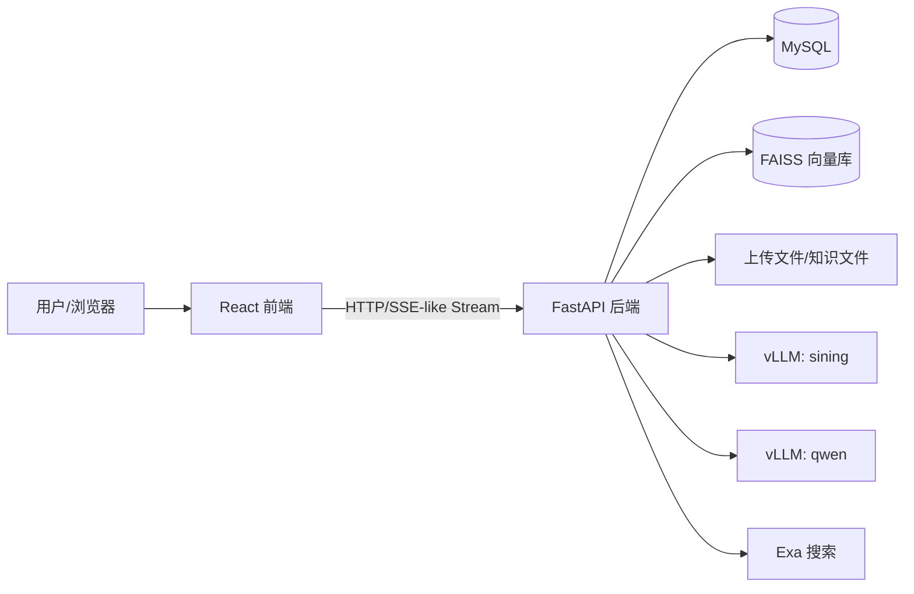

# 司宁健康管理助手技术栈文档

本文档面向开发、部署和二次开发人员，说明项目的技术选型、模块职责、数据流和运行依赖。

## 1. 总体架构

系统由四个核心层组成：



- 前端负责交互、文件上传、流式展示、执行轨迹和反馈入口。
- 后端负责鉴权、会话、文件、知识库、记忆、工作流和模型调用。
- vLLM 提供 OpenAI 兼容接口。
- MySQL 保存用户、会话、消息、记忆、反馈、角色和智能体事件。
- FAISS 保存公共知识库与用户个人知识库向量索引。

## 2. 前端技术栈

| 技术 | 用途 |
|---|---|
| React 19 | 单页应用 UI |
| Vite 7 | 开发服务器、构建工具、代理配置 |
| Tailwind CSS 4 | 原子化样式与健康主题 UI |
| lucide-react | 图标库 |
| Zustand | 执行轨迹/状态辅助管理 |
| react-markdown | Markdown 渲染 |
| remark-gfm | GitHub Flavored Markdown |
| remark-math + rehype-katex + KaTeX | 数学公式渲染 |
| react-syntax-highlighter | 代码块高亮，当前懒加载 |

### 2.1 关键文件

- `frontend/llm/src/components/ChatInterface.jsx`
  - 主聊天界面。
  - 会话列表、消息气泡、文件上传、流式响应、反馈、对话分支重生成、引用来源、执行轨迹入口。
- `frontend/llm/src/components/AuthPage.jsx`
  - 登录、注册、验证码、密码重置界面。
- `frontend/llm/src/components/KnowledgePage.jsx`
  - 知识库文件管理。
  - 支持公共知识库和个人知识库切换；普通用户只能维护个人知识，管理员可维护公共知识。
- `frontend/llm/src/components/AdminFeedbackPage.jsx`
  - 管理员反馈数据管理界面。
  - 支持查看、编辑、删除和一键导出全部反馈数据。
- `frontend/llm/src/components/PersonalizationPage.jsx`
  - 用户个人信息、长期/短期记忆、候选记忆管理。
- `frontend/llm/src/stores/useLangGraphStore.js`
  - 将后端 `<<EV:...>>` 事件转换为前端时间线节点。
- `frontend/llm/src/utils/api.js`
  - `API_BASE = '/api'` 与鉴权请求封装。

### 2.2 前端数据流

1. 用户输入文本或上传文件。
2. 图片/文档先调用 `/upload` 得到 `file_id`。
3. 聊天请求调用 `/chat/{session_id}`，携带文本、文件 ID 和工具开关。
4. 后端流式返回：
   - `<<STATUS:...>>` 状态片段；
   - `<<EV:{...}>>` 智能体事件；
   - `<think>...</think>` 执行轨迹内容；
  - 正式回答正文；
  - `<<REFS:...>>` 引用来源；
  - `<<VIDEOS:...>>` 视频检索结果；
  - `<<ROLLBACK:...>>` 审核不通过时撤回当前回答并触发重生成。
5. 前端拆分正文、轨迹、引用和视频链接，渲染消息气泡、右侧时间线、来源列表与视频推荐卡片。

## 3. 后端技术栈

| 技术 | 用途 |
|---|---|
| FastAPI | HTTP API 与流式响应 |
| Uvicorn | ASGI 服务运行 |
| SQLAlchemy | ORM 与数据库模型 |
| PyMySQL | MySQL 驱动 |
| python-jose | JWT 鉴权 |
| passlib[argon2] | 密码哈希 |
| Pydantic | 请求/响应模型 |
| LangGraph | 多智能体工作流编排 |
| httpx | 调用 vLLM OpenAI 兼容接口 |
| FAISS | 本地向量索引 |
| sentence-transformers | 知识库 Embedding |
| PyTorch | 模型/Embedding/语音相关依赖 |
| faster-whisper | 语音识别 |
| fastapi-mail | 邮箱验证码 |
| Exa | 网络搜索工具 |

### 3.1 后端关键文件

- `backend/main.py`
  - FastAPI 应用入口。
  - 注册鉴权、文件、知识库、视觉聊天、个性化、反馈、语音路由。
- `backend/config.py`
  - 端口、模型服务、数据库、邮件、知识库、管理员账号、记忆、token 与模型采样温度配置。
- `backend/database.py`
  - SQLAlchemy 模型：用户、会话、消息、用户画像、记忆、候选记忆、压缩摘要、智能体事件、反馈。
- `backend/routers/vl_chat_routes.py`
  - 会话 CRUD、聊天流式接口、对话分支切换、单条回复分支重生成、图片转 OpenAI `image_url`、自动标题、消息持久化。
- `backend/health_workflow.py`
  - LangGraph 工作流核心：上下文加载、信息管理、规划、工具调用、执行、审核、记忆更新。
- `backend/health_memory.py`
  - 用户个人信息检索、短期/长期记忆、候选记忆、会话压缩摘要。
- `backend/health_tools.py`
  - 本地 RAG、健康网络搜索、饮食网络搜索、健康视频检索工具。
- `backend/rag_core.py` / `backend/rag_text.py`
  - 知识库切分、Embedding、FAISS 建库与检索。
  - 支持公共知识库与用户个人知识库分域索引。
- `backend/routers/personalization_routes.py`
  - 用户画像和记忆管理 API。
- `backend/routers/feedback_routes.py`
  - 点赞、点踩、取消反馈、反馈记忆沉淀。
  - 管理员可查看、修改、删除和导出所有反馈数据。

### 3.3 用户角色与管理员能力

用户表 `users.role` 支持 `user` 和 `admin` 两类角色。

默认管理员账号配置集中在 `backend/config.py`：

| 配置项 | 默认值 | 说明 |
|---|---|---|
| `ADMIN_USERNAME` | `admin` | 默认管理员用户名 |
| `ADMIN_EMAIL` | `admin@sining.local` | 默认管理员邮箱 |
| `ADMIN_DEFAULT_PASSWORD` | `Admin@123456` | 默认管理员密码，生产环境应通过环境变量覆盖 |

后端启动时 `backend/main.py` 会调用 `ensure_default_admin()`：

- 如果管理员账号不存在，自动创建。
- 如果同名账号已存在但不是管理员，自动提升为 `admin`。
- 普通用户不能注册 `admin/root/system` 等系统保留用户名。

管理员专属能力：

- 上传、重建和删除公共知识库文件。
- 查看、编辑、删除所有用户反馈数据。
- 一键导出全部反馈数据 CSV。

普通用户能力：

- 只能上传、重建和删除自己的个人知识库文件。
- 可以检索公共知识库和自己的个人知识库。
- 不能删除公共知识，不能访问其他用户的个人知识库。

### 3.2 对话分支与单条回复重生成

- 前端在每条 assistant 消息的点赞/点踩按钮旁提供重新生成按钮。
- 接口：`POST /chat/{session_id}/messages/{message_id}/regenerate`。
- 后端根据目标 assistant 消息的 `parent_id` 精确找到对应 user 消息，复用其文本与附件重新执行健康管理工作流。
- 数据库存储采用消息树结构：`messages.parent_id` 记录父消息，`sessions.active_leaf_message_id` 记录当前激活分支叶子。
- 重新生成不会覆盖旧 assistant 消息，而是在同一个 user 消息下新增一个 assistant 子节点，形成新的对话分支。
- 前端只展示当前激活叶子到根的路径；当同一 user 消息下存在多个 assistant 分支时，显示 `‹ 1/2 ›` 控件。
- 分支切换接口：`POST /sessions/{session_id}/branch`，切换后后端会将当前会话激活到所选分支的最深叶子。
- 重生成时工作流只读取目标 user 消息之前的历史上下文，避免把旧回复或后续消息作为依据污染新答案。

## 4. 模型服务设计

项目将不同智能体分配给两个 vLLM OpenAI 兼容服务：

| 服务 | 默认端口 | 模型名 | 主要职责 |
|---|---:|---|---|
| Planner / Executor | 8000 | `sining` | 意图规划、工具调用、最终回答、多模态视觉输入 |
| Manager / Reviewer / Compression / Title | 8001 | `qwen` | 信息抽取、摘要压缩、回答审核、标题生成 |

后端通过 `backend/health_llm.py` 中的 `VLLMClient` 调用 `/chat/completions`。

### 4.1 模型温度配置

模型采样温度统一在 `backend/config.py` 中配置，并支持通过同名环境变量覆盖：

| 配置项 | 默认值 | 作用阶段 |
|---|---:|---|
| `CONTEXT_MANAGER_TEMPERATURE` | `0.1` | 用户个人信息/记忆抽取 |
| `COMPRESSION_TEMPERATURE` | `0.1` | 会话上下文压缩 |
| `PLANNER_TEMPERATURE` | `0.2` | 意图规划与工具选择 |
| `INFO_REFINER_TEMPERATURE` | `0.1` | 工具结果整理 |
| `EXECUTOR_TEMPERATURE` | `0.5` | 正式回答生成 |
| `REVIEWER_TEMPERATURE` | `0.1` | 回答审核 |
| `REGENERATION_TEMPERATURE` | `0.45` | 审核不通过后的重生成 |
| `SESSION_TITLE_TEMPERATURE` | `0.1` | 会话标题生成 |

温度越低，输出越稳定；温度越高，表达越发散。生产环境建议将审核、压缩、标题等结构化阶段保持较低温度。

## 5. 多智能体工作流

核心状态类型：`HealthState`。

主要阶段：

1. `load_context`
   - 检索用户个人信息。
   - 压缩长会话上下文。
   - 拼接未压缩近期消息。
2. `context_manager`
   - 抽取重要短期记忆。
   - 生成待确认候选记忆。
3. `intent_analyzer`
   - 识别意图。
  - 决定是否调用 RAG、网络搜索或视频检索工具。
4. `tool_dispatcher` / `info_refiner`
   - 执行 RAG 或网络搜索。
   - 整理外部参考信息。
5. `llm_generator`
   - 基于意图模板、个人信息、历史、附件、工具结果生成正式回答。
6. `feedback_reviewer`
   - 审核回答是否有依据、是否合规。
7. `regenerate`
   - 必要时按 reviewer 指令重写一次。
8. `memory_updater`
   - 写入智能体事件和记忆结果。

## 6. 视觉输入链路

1. 前端上传图片到 `/upload`。
2. 后端保存文件并写入 `backend/file_metadata.json`。
3. 前端聊天请求携带：

```json
{
  "files": [{"id": "file_id", "name": "xxx.png", "size": 12345}]
}
```

4. `vl_chat_routes.py` 根据文件 ID 查找磁盘路径。
5. 图片转为 OpenAI 兼容格式：

```json
{"type": "image_url", "image_url": {"url": "data:image/png;base64,..."}}
```

6. `_planner_user_message` 和 `_executor_user_message` 将文本与图片一起传给模型。

## 7. 数据库模型概览

| 表 | 说明 |
|---|---|
| `users` | 用户账号 |
| `verification_codes` | 邮箱验证码 |
| `sessions` | 会话，含自动标题开关 |
| `messages` | 用户/助手消息和附件元数据 |
| `user_profiles` | 用户个人信息/画像 |
| `personalization_memories` | 长期、短期、偏好、反馈等记忆 |
| `memory_candidates` | 待确认候选记忆 |
| `memory_summaries` | 当前会话压缩摘要 |
| `agent_events` | 智能体运行事件与追踪数据 |
| `feedback_records` | 用户反馈与审核反馈 |

## 8. RAG 知识库

知识库分为公共知识库和个人知识库：

| 类型 | 源文件目录 | 向量库目录 | 权限 | 检索可见性 |
|---|---|---|---|---|
| 公共知识库 | `backend/data/` | `backend/vdb_store/indexes/` | 仅管理员可上传、重建、删除 | 所有用户可检索 |
| 个人知识库 | `backend/user_knowledge/data/{user_id}/` | `backend/user_knowledge/indexes/{user_id}/` | 当前用户可上传、重建、删除 | 仅当前用户可检索 |

- Embedding 模型路径由 `EmbeddingConfig.EMBEDDING_MODEL` 配置。
- 默认切块：`CHUNK_SIZE = 500`，`CHUNK_OVERLAP = 50`。
- 默认检索：`TOP_K = 5`，相似度阈值 `0.6`。

### 8.1 知识库配置

知识库路径配置集中在 `backend/config.py` 的 `EmbeddingConfig`：

| 配置项 | 说明 |
|---|---|
| `PUBLIC_DATA_SOURCE_PATH` | 公共知识源文件目录，默认沿用 `backend/data/` |
| `PUBLIC_INDEX_DIR` | 公共知识向量索引目录，默认沿用 `backend/vdb_store/indexes/` |
| `USER_DATA_ROOT` | 个人知识源文件根目录 |
| `USER_INDEX_ROOT` | 个人知识向量索引根目录 |

RAG 工具 `search_rag` 会联合检索：

1. 公共知识库；
2. 当前登录用户的个人知识库。

不会检索其他用户的个人知识库，管理员账号也不会介入普通用户的个人知识库检索。

### 8.2 知识库接口权限

| 接口 | 说明 |
|---|---|
| `GET /knowledge/status?scope=public|personal|all` | 查看知识库状态 |
| `GET /knowledge/files?scope=public|personal|all` | 查看当前用户可见文件 |
| `POST /knowledge/upload?scope=public|personal` | 上传文件；公共库仅管理员可用 |
| `DELETE /knowledge/files/{filename}?scope=public|personal` | 删除文件；公共库仅管理员可用，个人库仅当前用户可删 |
| `POST /knowledge/rebuild?scope=public|personal` | 重建索引；公共库仅管理员可用 |
| `POST /knowledge/search_test` | 联合测试检索公共库和当前用户个人库 |

### 8.3 管理员反馈接口

| 接口 | 说明 |
|---|---|
| `GET /feedback/admin` | 管理员查看最近反馈数据 |
| `PATCH /feedback/admin/items/{feedback_id}` | 管理员修改反馈数据 |
| `DELETE /feedback/admin/items/{feedback_id}` | 管理员删除反馈数据 |
| `GET /feedback/admin/export` | 管理员导出全部反馈 CSV |

## 9. Exa 网络与视频检索

- 普通网络检索由 `search_health_web` 提供，结果通过 `<<REFS:...>>` 附加到助手消息，前端可在来源面板查看。
- 视频检索由 `search_health_video` 提供，调用 Exa 并优先限定到 `bilibili.com`、`youtube.com` 等视频站点。
- 当用户明确需要“动作演示、跟练、视频教程、具体操作示范”时，Planner 可调用视频检索工具。
- 后端将视频结果解析为 `<<VIDEOS:...>>`，前端在助手气泡底部、功能栏上方渲染“推荐演示视频”链接卡片。
- 历史上下文清洗会移除 `<<VIDEOS:...>>`，避免视频元数据污染后续模型上下文。

## 10. 运行时文件与 Git 忽略

以下内容不应提交：

- `backend/uploads/`
- `backend/file_metadata.json`
- `backend/vdb_store/`
- `backend/user_knowledge/`
- `models/`
- `frontend/llm/node_modules/`
- `frontend/llm/dist/`
- Python 缓存、日志和本地虚拟环境

## 11. 部署注意事项

- 生产环境请将 `SECRET_KEY`、数据库密码、邮箱授权码、搜索 API Key 迁移到环境变量或密钥管理系统。
- 对公网暴露时只开放前端和后端服务，不要暴露 vLLM 和 MySQL 端口。
- 前端 API 代理在 `frontend/llm/vite.config.js` 中配置。
- AutoDL 端口映射时，前端 Vite 和 FastAPI 都需要绑定 `0.0.0.0`。

## 12. 当前建议的验证命令

后端导入检查：

```bash
cd /root/autodl-tmp
python - <<'PY'
from APP.backend.main import app
print('routes', len(app.routes))
PY
```

前端构建：

```bash
cd /root/autodl-tmp/APP/frontend/llm
npm run build
```

## 13. 二次开发建议

- 新增工具时，优先在 `health_tools.py` 注册 OpenAI tool schema 与执行函数。
- 新增工作流节点时，同步更新 `stream_health_workflow_events`，否则前端不会实时展示。
- 新增数据库字段时，在 `ensure_runtime_schema()` 中添加向后兼容迁移。
- 任何涉及医疗建议的改动都应保留“不能替代专业诊断”的风险提示。