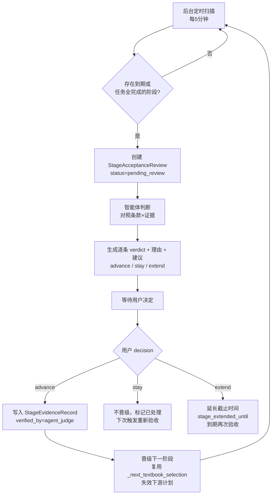

# 阶段验收改造设计：时间驱动 + 智能体判断 + 用户拍板

- 日期：2026-08-06
- 范围：`tiaozhanbei/backend/competition_app`（长期/短期学习计划验收机制）
- 状态：设计定稿，待实现

---

## 1. 背景与问题

### 1.1 现状

三层规划架构（长期计划 → 短期计划 → 当日任务）已有完整契约与持久化：

| 层 | 持久化 | 验收现状 |
|---|---|---|
| 长期计划 | `long_term_plan_versions`（`stages`/`milestones`/`planning_route`） | 任务完成时 `_reconcile_plan_progression` 用**文本归一化匹配**比对路线 `exit_evidence`，全过则自动晋级 |
| 短期计划 | `short_term_plan_versions`（`short_term_learning_package.completion_criteria`） | 任务完成时 `_short_term_gate_passed` 用 task_blocks 内容与任务文本**文本匹配** |
| 当日任务 | `learning_task_versions` | 项完成即任务完成 |

### 1.2 问题清单

1. **用户个性化规划被丢弃**：长期计划 `stages` 是 LLM 为用户生成的（含"晋级条件"），但阶段门禁只读静态路线 `exit_evidence`，用户化条款完全不参与判定。
2. **文本匹配不可靠**：
   - 短期 `completion_criteria`（如"基础测评正确率≥80%"）与任务文本完全不同，无法匹配（已实测生产数据验证）。
   - 长期条款是自然语言（如"能口头复述四君子汤配伍"），文本匹配既漏判又误判。
3. **阶段时间未参与验收**：`stages[].duration_days` / `package.duration_days` 存在但无阶段开始时间，无法按计划节奏触发验收。
4. **用户无决定权**：晋级是自动的，用户既看不到判断依据，也无法否决或延期。

### 1.3 目标

- 验收 = **时间到期触发** → **智能体判断**（对照条款与证据）→ **用户拍板**（晋级/停留/延期）。
- 删除全部文本匹配判定逻辑。
- 用户长期计划中的个性化晋级条件（`acceptance`）与路线 `exit_evidence` 一并作为验收条款。

---

## 2. 已确认的决策

| # | 决策点 | 结论 |
|---|---|---|
| 1 | 触发时机 | **双触发**：时间到期 **或** 当前短期周期任务全部完成（后者证据最齐） |
| 2 | 短期与长期关系 | 短期验收通过后**顺带触发长期阶段验收**（短期是长期的手段，一次会话完成两级） |
| 3 | 用户不操作时 | **挂着等用户**，不超时自动执行；pending 的 review 出现在待办列表 |
| 4 | 文本匹配 | **全部删除**，不做任何"快速预筛"保留 |
| 5 | 验收条款构成 | 路线 `exit_evidence`（基线）+ 用户 `stages[].acceptance`（个性化）+ 里程碑 `evidence_required`（存量），合并去重保序 |

---

## 3. 总体流程



### 3.1 触发规则（双触发）

对每个学习者，扫描当前长期阶段 `N` 与当前短期周期：

1. **时间到期**：`now ≥ stage_deadline`，其中
   `stage_deadline = max(stage_started_at + duration_days, stage_extended_until)`
2. **任务全完成**：当前 `learning_task.status == "completed"`（此时证据最齐）
3. 同一 scope 已有 `status ∈ (pending_review, pending_decision)` 的 review → 跳过（幂等）
4. 存量计划 `stage_started_at` 为空 → 不触发，下次晋级时初始化计时

短期触发优先级高于长期：先验收短期；短期通过（用户 advance 或智能体建议且通过）后顺带触发长期验收。

---

## 4. 数据层设计

### 4.1 契约（`contracts/learning_plan.py`）

```python
class LongTermPlan(ContractModel):
    ...
    stage_started_at: datetime | None = None      # 新增：当前阶段开始时间
    stage_extended_until: datetime | None = None  # 新增：延长后的截止（extend 时写入）
    # 晋级到下一阶段时：stage_started_at = now，stage_extended_until = None

class ShortTermPlan(ContractModel):
    ...
    started_at: datetime | None = None            # 新增：当前短期周期开始时间

class StageAcceptanceReview(ContractModel):       # 新增
    review_id: str
    learner_id: str
    scope: Literal["long_term_stage", "short_term"]
    stage: int | None                              # 长期阶段号；短期为 None
    trigger: Literal["time_elapsed", "tasks_completed"]
    status: Literal["pending_review", "pending_decision", "decided"]
    clauses: list[AcceptanceClause]                # 条款清单（合并后）
    judge_result: AgentJudgement | None            # 智能体判断结果
    user_decision: Literal["advance", "stay", "extend"] | None
    created_at: datetime
    decided_at: datetime | None

class AcceptanceClause(ContractModel):            # 新增
    clause_id: str
    text: str
    source: Literal["route", "plan_stage", "milestone", "short_term_criteria"]
    judge_verdict: Literal["satisfied", "unsatisfied", "insufficient_evidence"] | None
    judge_reason: str = ""

class AgentJudgement(ContractModel):              # 新增
    recommendation: Literal["advance", "stay", "extend"]
    summary: str                                   # 自然语言总结，给用户看
```

### 4.2 持久化（新增 `migrations/017_stage_acceptance_reviews.sql`）

```sql
CREATE TABLE IF NOT EXISTS stage_acceptance_reviews (
    review_id VARCHAR(128) PRIMARY KEY,
    learner_id VARCHAR(128) NOT NULL,
    scope VARCHAR(32) NOT NULL,               -- long_term_stage | short_term
    stage INT NULL,
    trigger VARCHAR(32) NOT NULL,             -- time_elapsed | tasks_completed
    status VARCHAR(32) NOT NULL,
    payload_json JSON NOT NULL,
    created_at TIMESTAMP(6) NOT NULL DEFAULT CURRENT_TIMESTAMP(6),
    decided_at TIMESTAMP(6) NULL,
    INDEX idx_stage_acceptance_learner (learner_id, status, created_at)
);
```

- 新 `StageAcceptanceReviewRepository`（MySQL + InMemory 双实现，沿用 `LearningPlanRepository` 惯例）
- review 状态变更时 `save_current` 同步更新计划层（`stage_started_at` / `stage_extended_until` / 晋级）

### 4.3 存量兼容

- 老计划 `stage_started_at = None` → 不触发自动验收，行为与现在一致（零打扰）
- 老计划 `stages[].acceptance` 为空 → 条款 = 路线基线 + 里程碑（与现判定范围一致）
- `StageEvidenceRecord.source_type` 增加 `agent_judge` 取值（当前 Literal 只有 `completed_daily_task | audited_assessment`）

---

## 5. 智能体判断层

### 5.1 新 agent：`stage_acceptance_judge`

- 输入：
  - **条款清单**：合并后的 `AcceptanceClause` 列表（来源可区分）
  - **证据**：当前阶段内已完成任务的 `task_content` / `expected_output` / `completion_criteria`、答题记录（正确率）、复习记录
- 输出（`AgentJudgement`）：
  - 每条条款一个 `verdict`（`satisfied` / `unsatisfied` / `insufficient_evidence`）+ 理由
  - 整体 `recommendation`（`advance` / `stay` / `extend`）+ 自然语言总结
- **硬约束**（写入 prompt skill）：
  - 证据不足必须判 `insufficient_evidence`，禁止臆断
  - 判断依据只许引用证据中的具体事实
  - 所有条款都满足 → 只能建议 `advance`；存在 unsatisfied → 建议 `stay` 并说明差距；存在 insufficient → 建议 `extend` 或 `stay`
- 复用现有 `ChatModel` / prompt registry / stub 模式（`llm/` 层不动）

### 5.2 条款来源（与已改的 `_stage_requirements` 合并逻辑一致）

| scope | 条款 |
|---|---|
| 长期阶段 | 路线 `exit_evidence`（route）+ `stages[].acceptance`（plan_stage）+ 里程碑 `evidence_required`（milestone） |
| 短期 | `short_term_learning_package.completion_criteria` + `expected_output` |

---

## 6. 用户决定层（API）

| 方法 | 路径 | 说明 |
|---|---|---|
| GET | `/api/v1/plan-acceptance/reviews` | 当前用户 review 列表（含 pending 待决定项，展示智能体建议与理由） |
| POST | `/api/v1/plan-acceptance/reviews/{review_id}/decision` | body: `decision ∈ advance \| stay \| extend` |
| GET | `/api/v1/plan-acceptance/reviews/{review_id}` | 单条详情（条款×verdict×证据引用） |

`advance` 动作复用现有晋级逻辑：写入 `StageEvidenceRecord`（`verified_by="agent_judge"`）→ `_next_textbook_selection` 选下一阶段 → `save_current(..., invalidated_layers=["short_term", "daily_task"])` → 初始化新阶段计时。

---

## 7. 定时触发层

- `api/app.py` lifespan 增加后台任务 `stage_acceptance_scan`（每 5 分钟，先例：workshop 分发循环）
- 扫描范围：`learner_plan_states` 中所有有长期计划的学习者
- 每次扫描：到期检测 → 建 review → 调 judge agent（`asyncio.to_thread` 包裹同步调用）
- 失败安全：单学习者异常不影响整轮扫描；judge 失败则 review 停在 `pending_review` 下次重试

---

## 8. 删除文本匹配

| 位置 | 现状 | 改造 |
|---|---|---|
| `daily_task_execution.py::_reconcile_plan_progression` | 完成任务 → 文本匹配 → 自动晋级 | 任务完成只写状态；触发逻辑交给扫描器（创建 review） |
| `daily_task_execution.py::_short_term_gate_passed` | task_blocks 文本匹配 | 删除 |
| `learning_plan.py::record_completed_task_stage_evidence` | 归一化匹配校验 | 保留手动入口，删除匹配校验（降级为用户声明证据，`verified_by="user_declared"`） |
| `_normalize_text` / `_normalize_evidence_text` | 归一化 | 删除（不再有匹配需求） |
| `plan_progress.py` | indicator 状态由文本匹配得出 | 改为读取 review/evidence 状态 |

---

## 9. 改动文件清单

```
# 新增
contracts/learning_plan.py           +StageAcceptanceReview/AcceptanceClause/AgentJudgement
                                     +LongTermPlan.stage_started_at/stage_extended_until
                                     +ShortTermPlan.started_at
                                     +StageEvidenceRecord.source_type 增加 agent_judge
migrations/017_stage_acceptance_reviews.sql
repositories/stage_acceptance_review.py
agents/stage_acceptance_judge.py
prompt_skills/acceptance_judge/acceptance_judge.md
services/stage_acceptance.py         (触发扫描 + 决定执行)
api/app.py                           3 个 API + lifespan 扫描任务

# 修改
agents/diagnosis.py                  晋级/创建时写 stage_started_at
agents/plan_contract_compiler.py     (已完成 acceptance 提取，保持)
services/daily_task_execution.py     删除文本匹配，任务完成仅标状态
services/learning_plan.py            手动证据降级 + _stage_requirements 保留为条款来源
services/plan_progress.py            indicator 状态源改为 review/evidence
application/container.py             注册新 repository/service
```

**已改未提交**（本轮已完成的契约/编译器部分）：`contracts/learning_plan.py`、`contracts/plan_compilation.py`、`agents/plan_contract_compiler.py`、`agents/diagnosis.py`、`services/daily_task_execution.py`、`services/learning_plan.py`、`services/plan_progress.py` —— 其中 contract/compiler 部分保留，判定与展示部分将按本报告重做。

---

## 10. 测试计划

1. **触发**：到期触发（时间构造）/ 任务完成触发 / 幂等（已有 pending 不重复建）
2. **智能体**：stub 模式返回 verdict；证据不足 → `insufficient_evidence`；条款全满足 → `advance`
3. **决定**：advance 晋级 + 失效下游 + 新阶段计时初始化；stay 不晋级；extend 更新截止并再次触发
4. **兼容**：存量计划（无 `stage_started_at`/无 `acceptance`）不触发、判定范围不变
5. **回归**：现有治理测试 23 项保持通过（重点：plan 契约校验、晋级流程）

---

## 11. 未决/后续

- 前端：`learning-stage` 页面增加"待验收"卡片与决定按钮（本报告仅后端，前端另立任务）
- 通知：review 创建时可推 `notification_records`（backend_handoff 已有机制，可选接入）
- judge agent 的 evidence 数据源清单需在实现时与 `backend_handoff` 对齐（答题正确率、复习记录读取路径）
