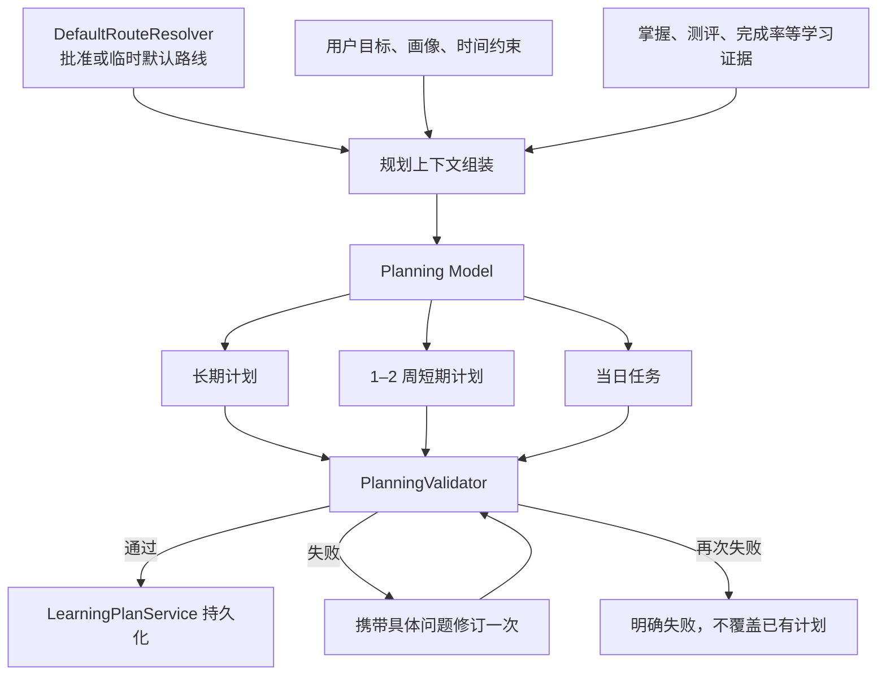

# 三层中医药学习规划设计

## 1. 目标

重构现有学习规划链路，使默认路线、模型规划与系统事实各自承担清晰职责：

- 系统提供经过批准的默认路线、具体教材、顺序依据、验收证据和用户学习事实；
- 模型综合默认路线与用户情况，分别生成长期计划、未来 1–2 周短期计划和当日任务；
- 系统只校验、持久化和生成系统字段，不再把默认路线文本拼接到模型正文；
- 已有有效长短期计划默认复用，仅在明确、持续的事实变化或经过澄清的用户重规划请求下更新；
- 最终页面展示三个独立、自然语言优先的用户产物，不暴露内部路线元数据。

## 2. 核心原则

### 2.1 默认路线与个人计划分离

默认路线是稳定、低频、强来源、经过审核的系统知识。个人计划是模型基于默认路线、用户状态和时间条件生成的用户实例。模型不得修改全局路线、删除批准阶段、虚构教材或改变强前置关系。

### 2.2 三层计划分离

系统持有三个独立产物：

1. 长期计划：回答最终目标、阶段路径、教材、验收和晋级条件；
2. 短期计划：回答未来 1–2 周如何推进当前长期阶段；
3. 当日任务：回答今天具体使用什么材料、执行什么动作以及如何验收。

长期计划约束短期计划，短期计划约束当日任务。当日结果反向成为短期调整和长期阶段判断的证据。

### 2.3 自然语言优先

模型主要输出三个 Markdown 正文。仅保留系统执行必需的动作、优先模式、时长、产出和完成标准，不要求模型重复输出复杂的目标契约、里程碑、恢复策略或路线对象。

### 2.4 复用优先

已有有效长期或短期计划时默认原样复用。普通知识讲解、复习卡、查看学情、单次答错或单日未完成，不触发计划重写。

## 3. 总体数据流



## 4. 组件职责

### 4.1 DefaultRouteResolverAgent

负责：

- 从用户长期目标或明确路线标识中解析批准路线；
- 无安全匹配时返回临时路线及假设、待确认项；
- 提供阶段名称、具体教材、学习重点、顺序依据、验收证据和个性化边界。

不负责生成用户计划正文。

### 4.2 规划上下文组装

只向模型发送规划所需内容：

- 用户长期目标、短期目标、明确期限、可用时间和偏好；
- 已掌握内容、薄弱内容、当前阶段、近期完成情况和测评摘要；
- 默认路线状态；
- 每个阶段的名称、教材、重点、顺序依据、验收证据；
- 允许压缩、延长、并行或暂缓进入的边界；
- 已有长期、短期计划及其有效性；
- 到期复习和当日时间预算。

不发送：执行 ID、资源 ID、知识点内部 ID、Agent Envelope、完整 Pydantic Schema、路线来源编号、无关题目详情和系统可自行确定的状态字段。

### 4.3 DiagnosisAgent / Planning Model

模型负责：

- 综合默认路线和用户事实；
- 对每阶段标记正常学习、压缩复核、重点补弱或暂缓进入；
- 调整阶段时长和允许的并行安排；
- 分别生成长期、短期和当日三个自然语言计划；
- 在默认路线缺失时生成完整临时规划，并明确假设和待确认项；
- 当校验失败时依据具体问题修订一次。

模型不得：

- 修改批准路线阶段关系；
- 删除默认阶段；
- 虚构默认路线之外的教材；
- 将用户自述直接等同于稳定掌握；
- 生成系统 ID、版本、持久化状态或内部来源编号。

### 4.4 PlanningValidator

从 DiagnosisAgent 中独立，负责确定性校验：

- 三层格式完整性；
- 长期计划对默认路线阶段和教材的覆盖；
- 默认路线顺序与前置关系不被修改；
- 短期计划属于当前长期阶段并覆盖 1–2 周；
- 当日任务对应短期任务；
- 三层目标、教材、产出和完成标准一致；
- 时间预算不超载；
- 到期复习抢占时仍保留短期主线最低维护动作；
- 临时规划包含假设和待确认项。

首次失败时输出明确问题列表并允许模型修订一次。再次失败则终止本次生成，不覆盖已有计划。

### 4.5 LearningPlanService

只负责：

- 将已校验的自然语言内容落为 LongTermPlan、ShortTermPlan 和 LearningTask；
- 生成计划 ID、版本、状态、时间和写回记录；
- 按复用或更新动作处理版本；
- 保留现有计划，直至新计划校验成功。

不负责补写、拼接或改写规划正文。

## 5. 模型输出契约

模型返回一个小型 JSON 对象：

```json
{
  "long_term_plan_content": "长期计划 Markdown",
  "short_term_plan_content": "短期计划 Markdown",
  "daily_task_content": "当日任务 Markdown",
  "long_term_plan_action": "reuse",
  "short_term_plan_action": "reuse",
  "daily_task_action": "update",
  "priority_mode": "normal",
  "estimated_minutes": 25,
  "expected_output": "今日可观察产出",
  "completion_criteria": "今日完成标准"
}
```

动作字段只用于执行：

- `long_term_plan_action`: `reuse | update`
- `short_term_plan_action`: `reuse | update`
- `daily_task_action`: `reuse | update`
- `priority_mode`: `normal | temporary_focus | recovery`

## 6. 长期计划格式

长期计划独立输出，包含以下五部分。

### 6.1 目标契约

- 目标类型；
- 最终目标和期限；
- 可观察能力；
- 达标证据；
- 默认路线状态；
- 已知限制；
- 待确认项。

### 6.2 能力图谱摘要

以表格呈现：

- 能力模块；
- 当前水平；
- 前置能力；
- 达标证据；
- 优先级。

### 6.3 长期阶段路径

以表格呈现：

- 阶段；
- 时间范围；
- 具体教材；
- 阶段目标；
- 关键活动；
- 验收证据；
- 进入下一阶段条件；
- 当前个性化状态；
- 风险与调整。

批准路线的阶段和教材必须全部覆盖。模型可调整节奏，但不得改变路线骨架。

### 6.4 长期维护与恢复

包含主线中断时的最低维护量、恢复检查点和路径偏差修复动作。

### 6.5 长期重规划触发器

至少覆盖：

- 长期目标或期限变化；
- 默认路线、资格规则或教材版本变化；
- 长期可用时间稳定变化；
- 稳定能力证据显著变化；
- 阶段验收持续未通过。

## 7. 短期计划格式

短期计划独立输出，覆盖未来 1–2 周。

### 7.1 当前周期目标

说明当前长期阶段、本周期目标、周期范围和验收证据。

### 7.2 每日或每次任务表

包含：

- 日期或周次；
- 当前主目标；
- 长期主线维护；
- 具体任务；
- 时长；
- 可见产出；
- 完成标准；
- 反馈字段。

### 7.3 复习与测评

包含到期时间、内容、方法、通过标准和未通过后的动作。

### 7.4 短期覆盖与恢复

包含当前模式、临时目标、长期最低维护量、恢复复盘和路径偏差修复。

### 7.5 短期重规划触发器

至少覆盖：

- 连续任务未完成；
- 正确率持续下降；
- 实际耗时持续超预算；
- 本周期可用时间变化；
- 短期目标或事件变化。

## 8. 当日任务格式

当日任务独立输出，包含：

- 今日目标；
- 与短期计划的对应任务；
- 前置条件；
- 具体教材、章节或已检索材料；
- 分步动作和时间分配；
- 今日可见产出；
- 客观完成标准；
- 今日复习动作；
- 反馈字段；
- 未完成时的降级动作。

不得虚构教材章节、视频或资源。系统根据 `daily_task_content`、时长、产出和标准构建正式 LearningTask。

## 9. 到期复习抢占规则

到期复习可调整当日优先级，但必须保留短期主线最低维护动作：

- 当日时间充足：到期复习与主线任务并行；
- 当日时间紧张：优先完成到期复习，同时保留一个短时、可验证的主线维护动作；
- 无法同时完成：记录主线任务延期和恢复检查点，不得静默删除。

## 10. 计划复用与更新门禁

### 10.1 默认复用

已有有效计划时：

- 长期和短期正文原样复用；
- 普通知识讲解、复习卡、查看学情、单次错误、单日未完成均不触发重写；
- 当日任务可根据今日时间和到期复习重新生成。

### 10.2 自动调整条件

只使用明确事实和持续证据：

- 用户明确陈述目标、期限或时间发生变化；
- 系统连续多次观察到稳定变化；
- 默认路线、资格规则或教材版本发生变化；
- 阶段验收持续不通过。

单次错误、单日未完成或轻微字段波动不触发重规划。

### 10.3 用户明确要求重新规划

若用户只说“重新规划”“调整计划”或“计划不合适”，但未说明具体变化，必须先询问：

- 调整长期、短期还是两者；
- 目标或期限发生了什么变化；
- 当前可用时间；
- 希望保留和放弃什么；
- 调整原因和期望结果。

澄清前不得调用模型生成新计划，不得覆盖、失效或增加现有计划版本。

若用户已经明确说明变化，例如“未来两周每天只有 15 分钟，请调整短期计划”，则可直接更新对应层级。

## 11. 页面展示

正式结果区只展示：

1. 长期学习计划；
2. 未来 1–2 周计划；
3. 今日学习任务。

路线 ID、来源编号、模型协议和校验过程只允许出现在调试详情，不混入用户计划正文。

## 12. 测试与验收

### 12.1 自动化测试

使用 torch Python 环境验证：

- 批准路线输入完整到达模型；
- 模型输出三个独立自然语言计划；
- 长期计划覆盖全部阶段、具体教材、验收证据和晋级条件；
- 短期计划覆盖 1–2 周并落到每日任务；
- 当日任务包含材料、步骤、时间、产出和完成标准；
- 已有计划默认原样复用；
- 单次表现变化不触发重规划；
- 持续事实变化只更新对应层级；
- 模糊重规划请求进入澄清状态且不覆盖现有计划；
- 到期复习抢占时保留主线维护动作；
- 非法教材、缺失阶段和时间超载触发一次修订；
- 第二次不合格时失败且保留旧计划。

### 12.2 Live 验收

在已启动的真实模型运行台点击执行，验证：

- 真实模型成功完成三层规划；
- 正式结果区展示长期、短期和今日三个区域；
- 长期阶段包含 Skill 默认路线中的具体书名；
- 页面不展示系统拼接的路线元数据；
- 已有计划复用场景正文保持不变；
- 明确变化场景只更新目标层级；
- 模糊重规划请求先询问用户，不生成新计划。
