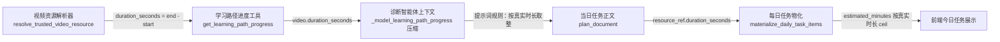

# 2026-08-02 视频真实时长与今日任务导航对接报告

## 变更概览

本次变更包含两个需求：

1. **视频任务预计时间 = 视频真实时长**：从视频来源解析层开始携带 `duration_seconds`，
   贯穿学习路径进度工具、诊断智能体上下文、每日任务物化，最终展示在今日任务卡片与列表中，
   避免“看视频”预估时间与视频实际时长脱节。
2. **知识点练习 → 专题训练对应知识点**：点击今日任务中的 `knowledge_practice` 原子项，
   直接进入专题训练（KnowledgePointTrainingHub）并锁定该知识点，不再进入通用题目训练面板；
   同时保留上一轮已完成的“视频任务 → 教材章节对应小节”深链。

## 数据流（视频时长）

- **解析层**：`resolve_trusted_video_resource` 返回字典新增
  `duration_seconds = round(end_seconds - start_seconds)`。
- **工具层**：学习路径进度工具构建的视频 dict 新增 `duration_seconds`
  （`max(video_duration, 0) or None`，解析失败为 `None`）。
- **智能体层**：`_model_learning_path_progress` 的 `compact_sections` 与 `current_section`
  视频字段白名单均加入 `duration_seconds`；`learning_plan.md` 提示词新增规则：
  分配观看视频任务预计分钟数时按真实时长向上取整，其余练习任务分配剩余时间。
- **物化层**：`materialize_daily_task_items` 重写时间分配——`video_section` 项
  `max(1, ceil(duration_seconds / 60))` 分钟（视频总分钟不挤占非视频项最低 1 分钟），
  非视频项平分剩余预算（余数逐个 +1）。
- **前端**：今日任务列表与卡片均优先用 `resource_ref.duration_seconds` 计算展示分钟，
  不再使用任务级 `estimated_minutes`（旧逻辑会显示不准确的 25 分钟等）。

## 数据流（今日任务导航）

- `knowledge_practice` 点击 → `{ page: 'practice', params: { view: 'workspace',
  taskType: 'topic_training', kpId, kpName, taskItemId,
  returnTo: { page: 'qualification-route', params: {} } } }`
  —— 训练上下文直接锁定该知识点。
- `video_section` 点击 → 先按 `resource_ref.kp_id` 调 `loadAtlasDetail` 解析教材位置，
  进入 `textbook-chapters` 对应“第 X 章第 X 节”，携带 `taskItemId` 与 `returnTo`。
- 两个入口的“返回”都回到今日任务页（`qualification-route`）。

## 修改文件

### 后端（`tiaozhanbei/backend/competition_app/`）

| 文件 | 变更 |
|---|---|
| `tools/knowledge_delivery.py` | 视频解析结果新增 `duration_seconds` |
| `application/container.py` | 学习路径进度视频 dict 新增 `duration_seconds` |
| `agents/diagnosis.py` | 两处视频字段白名单加入 `duration_seconds` |
| `services/learning_plan.py` | `materialize_daily_task_items` 按真实时长分配时间 |
| `prompt_skills/diagnosis_agent/learning_plan.md` | 新增“按视频真实时长取整分配预计时间”规则 |
| `tests/tools/test_knowledge_delivery.py` | 期望字典新增 `duration_seconds: 30` |
| `tests/services/test_daily_task_refresh_service.py` | 断言视频项按真实时长取整、总预算守恒 |

### 前端（`tiaozhanbei/frontend/llm/src/`）

| 文件 | 变更 |
|---|---|
| `pageIntent.js` | `WORKSHOP_DESTINATIONS` 新增 `workshop.topic_training` |
| `components/QualificationRoutePage.jsx` | 列表/卡片按真实时长展示分钟；`knowledge_practice` 跳专题训练；`video_section` 深链教材小节 |
| `components/QualificationRoutePage.test.jsx` | 新增 2 个用例：专题训练跳转、真实时长展示 |

## 验证

- 后端测试：`1058 passed, 3 skipped`（1 个已知无关失败在全量跑时通过）。
- 前端测试：`491 passed`（79 个文件）。
- 前端 `npm run build` 成功；后端重启后 `/health` 200。
- 线上验证（用户 王吉利）：
  - 今日任务卡片显示 `4分钟 / 3分钟 / 3分钟`（视频 239 秒 → 4 分钟，练习各 3 分钟）；
  - 点击知识点练习 → 专题训练，训练上下文锁定“中医学理论体系形成的标志”，
    `taskItemId` 正确携带；
  - 点击视频任务 → 教材《中医学基础》章节学习 → 返回 → 今日任务页。

## 契约变化（接口/字段）

- `GET /api/v1/dashboard/home` 的 `current_learning_task.items[].resource_ref` 新增
  `duration_seconds`（视频片段真实秒数，可能为 `null`）。
- 学习路径进度工具输出 `stages[].books[].sections[].video` 与 `current_section.video`
  新增 `duration_seconds`（仅诊断智能体内部使用，不直接对外）。
- 前端白名单动作新增 `workshop.topic_training`（`taskType: 'topic_training'`）。

完整字段契约见 [`frontend-api-reference.md`](frontend-api-reference.md) 第 5.1 节与第 10 节。
