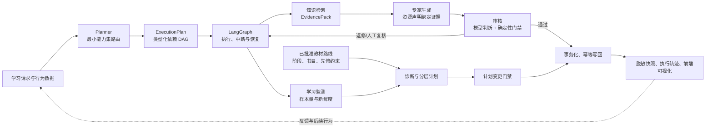
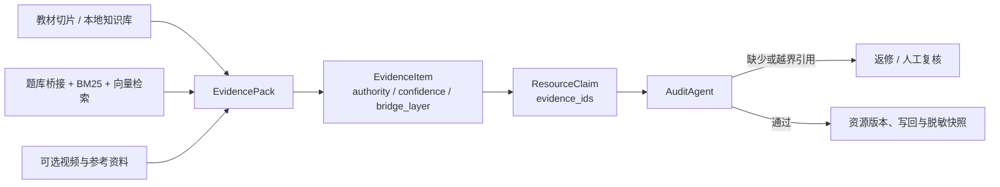
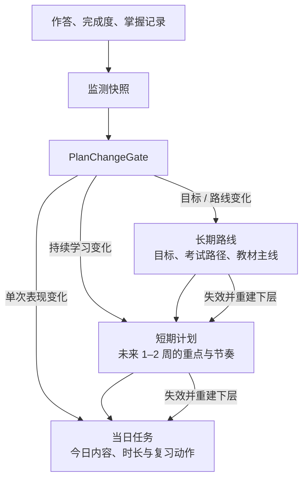
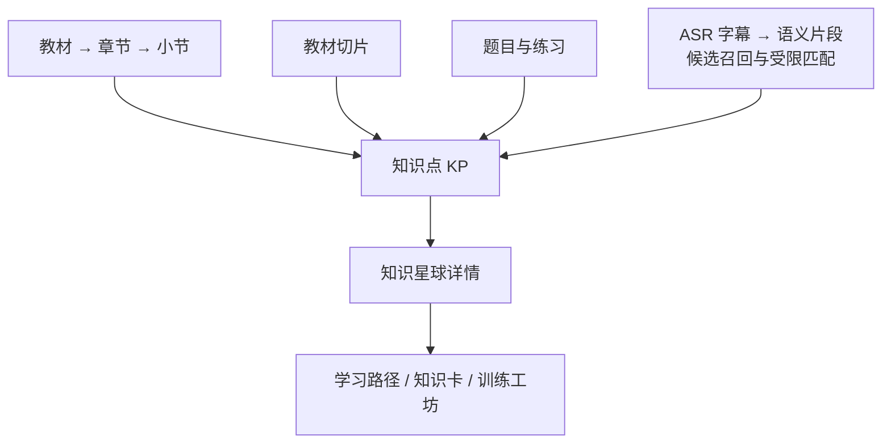

# 时珍智训：五个核心创新点与四项补充创新的可行性核验

> **定位**：面向中医药学习场景的可信自适应学习系统。本文用于挑战杯答辩材料准备，保留原有五项核心创新，并补充四项经源码核验、与原五  项不重复的创新方向；重点说明“系统已经具备什么、下一步如何补强、哪些表述必须保持克制”。
>
> **核验基线**：`main @ 95e2cd2`；核验范围为 `backend/competition_app`、`frontend/llm` 及仓库说明文档的静态源码。本文评估的是**工程可行性**，不将未完成的功能、未执行的实验指标或教学成效写成既有事实。
>
> **安全边界**：系统服务于中医药教学训练与学习管理，不构成诊疗建议。

---

## 1. 一页总览

### 1.1 核心判断

本项目的创新不在于简单叠加“六个智能体”，而在于把生成式能力置于 **受约束编排、证据绑定、保守个性化、分层计划门禁、可审计写回** 的工程闭环中。原五项核心创新均有可复用的代码基础；另外还识别出课程路线约束、主动干预回测、多模态教学资产对齐、错题情境变式训练四项补充创新。

原五项用于构成答辩的主叙事；新增四项更适合用作“系统纵深能力”和现场演示亮点，避免把核心主线扩展得过散。

| 编号 | 核心创新                                 | 当前工程状态                                  | 工程可行性     | 近期优先级 |
| ---- | ---------------------------------------- | --------------------------------------------- | -------------- | ---------- |
| 1    | 任务自适应的受约束智能体协同与双重审核   | 🟡 已有动态路由、DAG、审核返修与人工升级      | **中高** | P0         |
| 2    | 多层证据包驱动的声明级可信生成           | 🟡 已有来源/置信/桥接层、声明引用与缺证拦截   | **中高** | P0         |
| 3    | 置信感知的学习者画像与保守个性化         | 🟡 已有样本量、新鲜度与低置信降级             | **高**   | P1         |
| 4    | 多时间尺度、抗震荡的动态学习闭环         | 🟡 已有三层计划、单次波动门禁与版本失效机制   | **中**   | P1         |
| 5    | 面向垂直领域的可审计、最小权限智能体治理 | 🟡 已有权限清单、写回前置条件、幂等与脱敏快照 | **高**   | P0         |

### 1.2 经核验的补充创新

| 编号 | 补充创新                               | 当前工程状态                                                  | 工程可行性     | 与原五项的差异                                             |
| ---- | -------------------------------------- | ------------------------------------------------------------- | -------------- | ---------------------------------------------------------- |
| 6    | 可信教材路线编译与先修约束学习路径     | 🟢 路线解析、规划校验与路径投影均有实现                       | **高**   | 约束“学什么、先学什么”，不等同于三层计划的“何时调整”。 |
| 7    | 证据门控的主动干预—反馈—效果回测闭环 | 🟡 学情覆盖门槛、干预、反馈与 72 小时回测已在交接业务域实现   | **中高** | 关注学习调控的干预生命周期，不等同于画像置信度。           |
| 8    | 知识点级多模态教学资产对齐与知识星球   | 🟡 教材切片、题目、视频片段与知识点聚合已有链路，依赖交接资产 | **中高** | 关注资源在同一知识点粒度的组织，不等同于通用检索证据包。   |
| 9    | 错题情境门控与私域变式训练生命周期     | 🟡 错因上下文、来源审核、用户隔离、发布和批改链路已实现       | **中高** | 关注训练行为与变式题闭环，不等同于一般资源生成。           |

**状态说明**

- 🟢 **已完成**：当前主线已有端到端实现，且可由代码直接核验。
- 🟡 **部分实现**：关键骨架已经存在，但不能把扩展目标说成既有能力。
- 🔵 **待验证**：需要通过离线数据、用户试验或安全测试验证，不能从静态代码直接推出效果。

### 1.3 系统可信闭环

---

## 2. 创新一：任务自适应的受约束智能体协同与双重审核

### 答辩核心表述

**系统不采用“所有智能体固定串行执行”的流水线，而是先识别任务类型，再选择完成任务所需的最小能力集合，将其编译为带依赖关系的执行 DAG。对于知识讲解、个性化复习卡和组卷等资源生成任务，结果同时接受模型语义审核与确定性业务门禁；遇到不确定情形可受控返修或转人工复核。学习计划任务则由规划前置条件与变更门禁控制，不强制进入资源审核链。**

这是一种“**模型负责语义选择，系统负责边界、依赖和状态变更**”的协同范式，适合知识讲解、三层计划、个性化复习卡和组卷等不同任务。

### 已有工程依据

| 能力                 | 代码依据                                                                                                                                        | 已能证明的事实                                                                                                                                                   |
| -------------------- | ----------------------------------------------------------------------------------------------------------------------------------------------- | ---------------------------------------------------------------------------------------------------------------------------------------------------------------- |
| 按任务选择 Agent     | `backend/competition_app/agents/planner.py`：`PlannerAgent.run()`、`_normalize_output()`                                                  | 已区分`knowledge_explanation`、`learning_plan`、`personalized_review_card`、`paper_generation` 等任务，并限制模型只输出任务类型、参与 Agent 与路由理由。 |
| 依赖补齐与最小交付链 | `planner.py`：`AGENT_DEPENDENCIES`、`complete_required_selection()`、`validate_selection()`                                             | 系统会补齐确定性依赖；例如专家生成必须进入审核链，知识讲解不能误带规划/调度 Agent。                                                                              |
| 动态 DAG 执行        | `backend/competition_app/contracts/execution.py`：`ExecutionPlan.validate_dag()`；`runtime/langgraph_orchestrator.py`：`compile_plan()` | 计划会被校验为无环 DAG，再动态编译为 LangGraph 状态图执行。                                                                                                      |
| 中断、恢复与受控返修 | `runtime/langgraph_orchestrator.py`：`execute()`、`resume()`、`_node_for_step()`                                                        | 工作流支持澄清中断与恢复；审核结果可触发一次受控返修、失败或人工复核等待。                                                                                       |
| 双重审核             | `backend/competition_app/agents/audit.py`：`run()`、`_audit_exam_paper()`                                                                 | 审核结果综合模型输出与确定性规则；可阻断缺证声明、时长不匹配、重复题、答案键不一致等问题。                                                                       |

### 可行性分析

| 维度       | 判断           | 依据与解释                                                                                            |
| ---------- | -------------- | ----------------------------------------------------------------------------------------------------- |
| 技术可行性 | **中高** | 动态路由、DAG 验证、LangGraph 编译、checkpoint 与恢复均已落在主链路，新增审核节点不需要推翻现有架构。 |
| 数据可行性 | **中高** | 任务类型、Agent 依赖、审核发现和执行 trace 已有结构化载体，可沉淀为路由与风险评测样本。               |
| 产品可行性 | **高**   | 用户可看到真实的执行状态、工具详情和人工审核等待状态，复杂协作不会完全成为“黑箱”。                  |
| 主要风险   | **中**   | Agent 数量增加会带来时延、失败传播和提示词耦合；因此不能用“越多智能体越好”的方式堆叠流程。          |

### 当前边界与最小补强

| 当前已实现                                                         | 不能夸大的地方                                             | 下一步最小可行补强（MVP）                                                                                  |
| ------------------------------------------------------------------ | ---------------------------------------------------------- | ---------------------------------------------------------------------------------------------------------- |
| 任务自适应路由、确定性依赖补齐、模型审核加规则门禁、一次受控返修。 | 当前不是任意智能体自由辩论，也不是多个独立大模型投票裁决。 | 对高风险声明或高风险组卷要求，按风险阈值插入“证据复核节点”；该节点只核验来源、覆盖与冲突，不生成新内容。 |
| 可等待人工审核并恢复运行。                                         | 当前返修次数受控，不应表述为无限自我反思或全自动闭环。     | 记录“路由选择—审核发现—人工结论”，形成可回放的路由正确性数据集。                                       |

### 建议验收指标（待测，不是既有结果）

1. **路由合规率**：执行计划通过 DAG 校验且满足任务依赖约束的比例。
2. **最小链路率**：在满足交付条件下，未引入非必要 Agent 的比例。
3. **审核拦截有效性**：人工标注问题中，被确定性门禁或审核节点成功拦截的比例。
4. **端到端时延**：按任务类型统计 P50 / P95 时延，防止安全补强显著损害交互体验。

---

## 3. 创新二：多层证据包驱动的声明级可信生成

### 答辩核心表述

**系统将教材、本地知识资产、题库、视频和外部参考资料组织为带来源等级、置信度、桥接层与风险提示的 EvidencePack；资源草稿中的结构化声明字段可以绑定证据 ID，审核阶段会拦截没有可追溯证据的声明引用。**

它把“检索到若干文本”提升为“**可被下游生成、审核、快照和资源发布共同使用的证据对象**”。

### 证据流可视化

### 已有工程依据

| 能力           | 代码依据                                                                                      | 已能证明的事实                                                                                         |
| -------------- | --------------------------------------------------------------------------------------------- | ------------------------------------------------------------------------------------------------------ |
| 统一证据对象   | `backend/competition_app/contracts/knowledge.py`：`EvidenceItem`、`EvidencePack`        | 单条证据具备`authority_level`、`confidence`、`bridge_layer`、来源 URL、资源类型等字段。          |
| 多来源证据组装 | `backend/competition_app/tools/knowledge_retrieval.py`：`build_evidence_pack()`           | 可组合本地交接知识、教材向量检索与可选外部视频/参考资料，并在弱证据、未映射知识点等情形添加风险提示。  |
| 三通道题库检索 | `backend/competition_app/tools/question_retrieval.py`：`QuestionHybridRetriever.search()` | 题目候选可由知识点 bridge、BM25、向量检索三通道汇合；桥接层区分`strict`、`llm`、`similarity`。   |
| 声明绑定证据   | `backend/competition_app/agents/expert.py`：`ResourceDraft(... claims=...)`               | 资源草稿的`claims` 结构化字段带 `evidence_ids`；当前默认生成主证据声明，证据并非只存在于提示词中。 |
| 缺证声明拦截   | `backend/competition_app/agents/audit.py`：`AuditAgent.run()`                             | 审核会检查每个`claims` 条目是否引用当前 EvidencePack 内存在的证据 ID，并将缺证情形升级为返修。       |

### 可行性分析

| 维度       | 判断           | 依据与解释                                                                                                     |
| ---------- | -------------- | -------------------------------------------------------------------------------------------------------------- |
| 技术可行性 | **中高** | 证据、声明、审核和快照之间已有明确对象边界；可在现有字段上增加蕴含判断、冲突关系和证据权重，无需重建资源协议。 |
| 数据可行性 | **中**   | 教材、题库、知识点映射已提供基础，但不同来源的权威等级、时效与冲突标注仍需持续治理。                           |
| 场景价值   | **高**   | 中医药学习中存在教材版本、辨析要点与外部资料质量差异；可追溯证据可降低“看似流畅但无依据”的生成风险。         |
| 主要风险   | **中高** | “证据 ID 存在”不等于“该证据真正蕴含该声明”；外部资料也不能与教材拥有相同权威性。                           |

### 当前边界与最小补强

| 当前已实现                                                              | 不能夸大的地方                                                                                              | 下一步最小可行补强（MVP）                                                                           |
| ----------------------------------------------------------------------- | ----------------------------------------------------------------------------------------------------------- | --------------------------------------------------------------------------------------------------- |
| 可携带来源等级、置信度、桥接层、风险提示；结构化声明字段可绑定证据 ID。 | 当前并非完整的声明—证据知识图谱；`conflict_evidence` 是协议字段，不代表已完成自动冲突消解。              | 引入`claim_id → evidence_id → support_type` 显式边，标注“直接支持 / 间接相关 / 冲突 / 不足”。 |
| 审核能发现缺失或不属于当前包的证据 ID。                                 | 当前检查主要是`claims` 字段的引用完整性，尚未自动把资源正文逐句拆分、逐声明验证蕴含，或自动裁定教材冲突。 | 对高风险/高权威声明先执行检索式重核，再用“原文片段 + 人工抽样”验证支持关系。                      |
| 题目可保留多检索通道和桥接层信息。                                      | 检索分数只能反映相关性或排序信号，不能直接视为医学事实正确概率。                                            | 为每类来源制定权威等级、有效期和可用范围，并在发布前按风险阈值过滤。                                |

### 建议评价口径（待测，不是既有结果）

当前代码可先测“结构化声明的引用绑定完整性”，后续再测“语义支持正确性”：

$$
C_{\text{bind}} = \frac{\#\{\text{带有且存在于当前证据包的结构化声明引用}\}}{\#\{\text{全部结构化声明}\}}
$$

$$
C_{\text{support}} = \frac{\#\{\text{经人工或可验证模型判定为被原文支持的声明}\}}{\#\{\text{已引用声明}\}}
$$

还应记录：来源权威等级分布、弱证据触发率、冲突发现率、人工抽检的错误引用率和无证生成率。所有指标应按“教材内知识讲解、题目生成、外部参考资源”分场景报告。

---

## 4. 创新三：置信感知的学习者画像与“保守个性化”

### 答辩核心表述

**系统不把一次作答或少量标签直接当作稳定画像，而是同时判断行为样本量与数据新鲜度；当证据不足时，主动降低诊断置信度、使用“证据积累中”的保守状态，并避免输出看似精准但没有数据基础的个性化结论。**

这使个性化从“根据标签推荐”转向“**先判断是否有资格个性化，再决定个性化力度**”。

### 已有工程依据

| 能力           | 代码依据                                                                                                    | 已能证明的事实                                                                                                                  |
| -------------- | ----------------------------------------------------------------------------------------------------------- | ------------------------------------------------------------------------------------------------------------------------------- |
| 学习监测快照   | `backend/competition_app/services/learning_monitoring.py`：`LearningMonitoringService.build_snapshot()` | 汇总活动、作答、掌握记录样本量，给出`sufficient / limited / insufficient` 证据状态与 `fresh / stale / unknown` 新鲜度状态。 |
| 数据不足时降级 | `backend/competition_app/agents/diagnosis.py`：`DiagnosisAgent.run()`                                   | 在监测证据不足或不可用时，诊断输入会降为“证据积累中”，置信度设为保守值`0.25`，并明确不作确定性学情判断。                    |
| 资源适配边界   | `backend/competition_app/agents/expert.py`                                                                | 资源草稿保留目标难度和可用时长；审核还会检查资源时长是否超过用户当前可用时间。                                                  |
| 计划前置条件   | `backend/competition_app/services/planning_readiness.py`、`agents/diagnosis.py`                         | 当画像或上层计划条件不足时，流程可要求补充资料或先生成必要的上层规划，而不是虚构完整计划。                                      |

### 可行性分析

| 维度       | 判断           | 依据与解释                                                                             |
| ---------- | -------------- | -------------------------------------------------------------------------------------- |
| 技术可行性 | **高**   | 样本计数、新鲜度和诊断输入已经结构化；加入画像置信度计算与策略阈值属于局部增强。       |
| 数据可行性 | **中高** | 系统已有学习行为、作答与掌握记录；需要在真实用户样本上处理缺失、偏差和冷启动。         |
| 产品可行性 | **高**   | “当前证据不足，先完成基础任务以积累画像”的解释，比生成过度承诺的推荐更容易建立信任。 |
| 主要风险   | **中**   | 当前置信度尚非经过统计校准的概率；不同学习指标的可靠性和影响权重还未形成可验证模型。   |

### 当前边界与最小补强

| 当前已实现                                         | 不能夸大的地方                                                           | 下一步最小可行补强（MVP）                                                                                          |
| -------------------------------------------------- | ------------------------------------------------------------------------ | ------------------------------------------------------------------------------------------------------------------ |
| 对样本量与新鲜度分级；数据不足时降低诊断结论强度。 | 不能称为已校准的“数字孪生”或真实掌握概率预测模型。                     | 定义画像质量函数$Q=f(\text{样本量},\text{新鲜度},\text{一致性},\text{来源可靠性})$，将其作为推荐策略的显式输入。 |
| 资源保留难度和时长约束。                           | 当前未看到“画像置信度—资源强度—解释措辞”的端到端统一传播与回归评测。 | 设定三档策略：低$Q$ 采用通用基础任务；中 $Q$ 给出带说明的推荐；高 $Q$ 才允许细粒度难度与节奏调整。           |
| 可触发澄清与前置资料补全。                         | 不能把“用户填写的偏好”与“系统观察到的学习能力”混为同等可靠的证据。   | 对用户自述、行为记录、批改结果分别保留来源与可信度，并向用户展示推荐依据摘要。                                     |

### 建议验收指标（待测，不是既有结果）

- **画像覆盖率**：具备足够数据支撑的活跃用户占比。
- **校准误差**：用 Brier Score、ECE 等指标检验画像置信度与后续表现是否一致。
- **保守策略正确率**：数据不足时，系统是否确实避免了高确定性、强干预推荐。
- **推荐解释一致性**：推荐文案中的依据是否可回溯到对应的样本量、新鲜度与学习行为。

---

## 5. 创新四：多时间尺度、抗震荡的动态学习闭环

### 答辩核心表述

**系统将学习决策拆分为长期路线、短期计划和当日任务三个时间尺度：上层变化会使下层失效并重建；一次偶发答错只影响当天任务，只有明确目标变化、路线变化或持续学习变化才允许调整上层计划。**

核心价值是避免推荐系统因短期噪声频繁改写长期目标，即“**小波动小调整，持续变化再重规划**”。

### 三层决策可视化

### 已有工程依据

| 能力               | 代码依据                                                                                                                                       | 已能证明的事实                                                                        |
| ------------------ | ---------------------------------------------------------------------------------------------------------------------------------------------- | ------------------------------------------------------------------------------------- |
| 三层计划实体与版本 | `backend/competition_app/services/learning_plan.py`：`materialize_long_term()`、`materialize_short_term()`、`materialize_daily_task()` | 长期、短期、当日任务是独立层级；更新长期会使短期/当日失效，更新短期会使当日失效。     |
| 计划变更门禁       | `backend/competition_app/services/plan_change_gate.py`：`PlanChangeGate.decide()`                                                          | 门禁依据明确变更、路线变化、持续学习变化和单次表现变化选择修改层级。                  |
| 单次波动保护       | `plan_change_gate.py`                                                                                                                        | `single_performance_change=True` 时，强制不更新长期与短期，只保留当日任务更新。     |
| 诊断过程接入门禁   | `backend/competition_app/agents/diagnosis.py`                                                                                                | 诊断 Agent 调用`PlanChangeGate`；指定层级时限定本次只生成对应层，防止模型越层改写。 |
| 行为证据质量输入   | `backend/competition_app/services/learning_monitoring.py`                                                                                    | 可向计划与诊断提供样本量、新鲜度和行为指标，为后续持续变化识别提供输入基础。          |

### 可行性分析

| 维度       | 判断           | 依据与解释                                                                                         |
| ---------- | -------------- | -------------------------------------------------------------------------------------------------- |
| 技术可行性 | **中**   | 三层数据模型、父子失效关系和变更门禁已经存在；但持续变化识别与定时调度尚未在主链路中形成完整闭环。 |
| 数据可行性 | **中高** | 作答、活动、掌握度和复习数据可构成时间序列；需要统一窗口、去噪与缺失数据处理口径。                 |
| 产品可行性 | **高**   | 用户能够理解“为什么今天调整、为什么不马上改长期计划”，可降低计划频繁变化带来的不信任。           |
| 主要风险   | **中高** | 若持续变化阈值过敏，会造成计划震荡；过钝则错过干预时机。阈值必须由真实学习数据验证。               |

### 当前边界与最小补强

| 当前已实现                                                                                  | 不能夸大的地方                                                                             | 下一步最小可行补强（MVP）                                                                  |
| ------------------------------------------------------------------------------------------- | ------------------------------------------------------------------------------------------ | ------------------------------------------------------------------------------------------ |
| 已根据`single_performance_change`、`sustained_learning_change` 等事实输入控制变更层级。 | `sustained_learning_change` 当前由上游上下文传入；不能表述为系统已自主完成持续变化识别。 | 以 7/14 天滑动窗口计算完成率、正确率、复习积压和数据量，输出可解释的持续变化标记与原因码。 |
| 上层更新会使下层版本失效。                                                                  | 当前不能证明已经找到全局最优的学习路径或最优控制策略。                                     | 为每次变更记录“触发证据、影响层级、用户确认、前后版本”，支持回滚和复盘。                 |
| 当日任务默认可更新，上层计划默认复用。                                                      | 不能把一次题目作答的错误直接解释为长期能力下降。                                           | 为不同变更配置冷却期、最小样本量和人工确认门槛，先用规则验证再考虑学习型策略。             |

### 建议验收指标（待测，不是既有结果）

$$
R_{\text{osc}} = \frac{\#\{\text{非显式请求导致的上层计划变更}\}}{\text{活跃学习周数}}
$$

在控制 $R_{\text{osc}}$ 的同时，还需衡量：计划调整后的任务完成率、复习积压变化、用户接受/拒绝率、同一证据条件下策略结果的一致性。指标不能只追求“改得更少”，还要验证“该改时能及时改”。

---

## 6. 创新五：面向垂直领域的可审计、最小权限智能体治理

### 答辩核心表述

**系统在关键业务链路中将智能体视为受治理的软件主体：已接入网关的 Agent 只能访问允许的数据域和工具；资源发布等关键写入必须满足审核前置条件并具备幂等性；执行过程、工具摘要和结果可导出为脱敏快照，前端同步展示实际执行轨迹。**

这不是单纯的“角色分工”，而是把权限、契约、审核、事务和审计拼成可落地的治理链。

### 已有工程依据

| 能力                     | 代码依据                                                                                | 已能证明的事实                                                                            |
| ------------------------ | --------------------------------------------------------------------------------------- | ----------------------------------------------------------------------------------------- |
| 数据域最小权限           | `backend/competition_app/runtime/data_permissions.py`：`AgentDataPermissionGateway` | 以 Agent、数据域、读写动作、可写字段和用户确认要求定义能力清单；未授权访问会抛出异常。    |
| 工具调用白名单           | `backend/competition_app/runtime/tool_registry.py`：`ToolRegistry.invoke()`         | 工具注册时指定允许调用的 Agent，运行时校验权限并记录安全的输入/输出摘要。                 |
| 权限网关实际接入         | `backend/competition_app/application/personalized_review_card.py`                     | 用户画像补全、试卷发布、知识卡发布等关键写入前调用`authorize()`。                       |
| 审核前置、事务与幂等写回 | `backend/competition_app/services/writeback.py`：`execute()`、`execute_batch()`   | 批量写回在数据库事务中执行；`audit_pass` 会查询已持久化审核结果，幂等键可避免重复提交。 |
| 脱敏快照                 | `backend/competition_app/runtime/snapshot.py`：`SnapshotExporter.export()`          | 导出前会遮蔽密钥、口令、认证头、Cookie、数据库连接串、手机号和身份证号等敏感信息。        |
| 可视化轨迹               | `frontend/llm/src/components/AgentTimeline.jsx`                                       | 前端呈现 Agent 状态、工具调用详情、耗时、人工审核等待和参考来源入口。                     |

### 可行性分析

| 维度       | 判断           | 依据与解释                                                                                 |
| ---------- | -------------- | ------------------------------------------------------------------------------------------ |
| 技术可行性 | **高**   | 权限规则、调用拦截、事务、幂等、快照与前端展示均已有可扩展切点。                           |
| 安全可行性 | **中高** | 已覆盖关键写入和常见敏感字段；仍需通过全路径接入审计和安全测试验证完整性。                 |
| 运维可行性 | **高**   | 结构化意图、审计结果、执行 trace 与快照便于故障定位、人工复核和竞赛演示。                  |
| 主要风险   | **中**   | 若某个新数据适配器绕过网关，最小权限就会失效；基于正则的脱敏也不是完整的数据泄漏防护体系。 |

### 当前边界与最小补强

| 当前已实现                                                  | 不能夸大的地方                                                     | 下一步最小可行补强（MVP）                                                                  |
| ----------------------------------------------------------- | ------------------------------------------------------------------ | ------------------------------------------------------------------------------------------ |
| 已配置 Agent 数据权限、工具白名单和部分关键写入的授权检查。 | 当前不能宣称每条数据访问路径都经过唯一、不可绕过的中央策略执行点。 | 将数据库/文件/外部检索适配器统一封装为策略执行点，并用集成测试验证“拒绝默认”的覆盖率。   |
| 已对审核通过后的资源发布执行事务化、幂等写回。              | 数据库审计记录不等同于区块链或密码学不可篡改账本。                 | 追加只写审计事件，记录策略版本、输入摘要哈希、审批人和结果哈希；按需加入哈希链或外部留存。 |
| 已支持快照脱敏和运行过程展示。                              | 正则脱敏无法替代分类分级、访问控制、密钥轮换和渗透测试。           | 建立敏感字段分类、脱敏回归样例、权限拒绝回归测试与异常告警。                               |

### 建议验收指标（待测，不是既有结果）

- **策略覆盖率**：关键数据读写与外部工具调用中，经统一授权点校验的比例。
- **未审核发布率**：没有满足 `audit_pass` 前置条件却成功发布的资源数，应为 0。
- **幂等重放正确率**：相同幂等键重试时，不产生重复资源、重复任务或重复审核记录的比例。
- **轨迹完整率**：可从执行 ID 关联到计划、Agent 输出、工具摘要、审核和写回意图的比例。
- **敏感信息泄漏率**：在脱敏样本集、日志与快照扫描中的命中率，应持续趋近于 0。

---

## 7. 经核验的四项补充创新

> 这四项不替代原五项核心创新，而是从课程可信性、学习调控、资源组织和训练闭环四个侧面补足系统差异化。除“可信教材路线”外，其余三项均依赖交接业务域、数据库或 Git 外教学资产；下述“已实现”均指源码链路存在，不等同于已验证教学效果或生产运行效果。  

### 7.1 创新六：可信教材路线编译与先修约束学习路径

**答辩核心表述**：系统不让模型从零编造学习书目，而是将用户目标解析到系统维护的已批准教材路线，再以阶段目标、主教材、先修课程和等价教材规则约束规划内容，并保留阶段出口证据作为路线元数据；正式长期计划可投影为“阶段 → 教材 → 知识点”的稳定学习路径。

| 已有工程依据                                                                                                       | 已能证明的事实                                                                                               |
| ------------------------------------------------------------------------------------------------------------------ | ------------------------------------------------------------------------------------------------------------ |
| `backend/competition_app/data/textbook_routes/tcm_textbook_routes.v1.json`                                       | 路线数据包含考试绑定、已批准状态、阶段书目、`prerequisites`、`equivalence_groups` 与 `exit_evidence`。 |
| `backend/competition_app/services/textbook_route.py`：`TextbookRouteRepository.resolve()`                      | 系统根据考试路线和专业关键词解析唯一教材路线；歧义或身份不足时返回澄清请求，而不是任意选择。                 |
| `backend/competition_app/services/planning_validator.py`：`PlanningValidator.validate()`                       | 校验模型选择的路线、阶段、书目、强前置条件、计划书目范围和当日时长，阻止规划偏离可信课程骨架。               |
| `backend/competition_app/services/learning_path_projection.py`：`LearningPathProjectionService.page()`         | 将已持久化长期计划投影为阶段、教材和知识点导航节点，并将掌握度投影为节点状态。                               |
| `backend/competition_app/tests/services/test_textbook_route_repository.py`、`test_learning_path_projection.py` | 源码测试覆盖七条批准教材路线、先修/等价规则及“阶段—教材—知识点”路径投影。                                |

| 可行性判断 | 结论                                                                                                                                                                                        |
| ---------- | ------------------------------------------------------------------------------------------------------------------------------------------------------------------------------------------- |
| 技术可行性 | **高**。路线解析、约束校验、计划持久化和前端导航之间已有清晰数据契约。                                                                                                                |
| 场景价值   | **高**。将大模型的自然语言规划限制在课程骨架内，降低不相关教材、跨阶段跳跃和不满足先修条件的风险。                                                                                    |
| 当前边界   | `exit_evidence` 与 `equivalence_groups` 已被建模，但尚不能据此宣称系统已自动完成阶段达标判定或等价教材自动解锁。路线是项目维护的已批准/专家整理目录，不应泛化为所有专业的官方培养方案。 |
| 下一步验收 | 统计路线解析歧义拦截率、违规书目拦截率、先修条件误放行率，并邀请课程教师抽检路线与阶段目标的一致性。                                                                                        |

### 7.2 创新七：证据门控的主动干预—反馈—效果回测闭环

**答辩核心表述**：系统在学习数据不足时不进行强干预；数据覆盖达到明确门槛后，才生成学习节奏调整建议，记录触发快照、用户反馈和基线，并在约定窗口后比较学习维度变化，形成可复盘的“识别—建议—反馈—回测”闭环。

| 已有工程依据                                                                                                               | 已能证明的事实                                                                                                   |
| -------------------------------------------------------------------------------------------------------------------------- | ---------------------------------------------------------------------------------------------------------------- |
| `backend/competition/backend-handoff-20260720/APP/backend/learning_governance_service.py`：`build_learning_insights()` | 计算作答、登录/专注、掌握状态等数据覆盖度；主动干预门槛为`coverage >= 0.6`、至少三次作答且至少一个掌握知识点。 |
| 同文件：`evaluate_intervention()`、`record_intervention_feedback()`                                                    | 干预会记录触发快照与基线，并保存用户接受、延期、不相关、过易、过难等反馈。                                       |
| 同文件：`evaluate_due_interventions()`、`run_plan_review()`、`run_automation_cycle()`                                | 支持在 72 小时后比较基线与当前维度变化；周度复盘可提出当日减负或短期计划调整建议。                               |
| `backend/competition_app/integrations/backend_handoff.py`：`load_learning_insights()`                                  | 主后端交接适配层可调用自动化周期，并把干预和计划复盘结果返回给主接口。                                           |
| `docs/learning-monitoring-methodology.md`                                                                                | 明确数据来源、覆盖度公式、干预门槛、资源匹配权重与“不将覆盖度当作统计置信度”的边界。                           |

| 可行性判断 | 结论                                                                                                                                                                                 |
| ---------- | ------------------------------------------------------------------------------------------------------------------------------------------------------------------------------------ |
| 技术可行性 | **中高**。已存在持久化生命周期、去重键、冷启动门槛、用户反馈和后续对比逻辑，可在不改变主 Agent 编排的前提下扩展。                                                              |
| 场景价值   | **高**。将“提醒用户学习”变为有数据门槛、有用户反馈、可回顾结果的谨慎干预。                                                                                                   |
| 当前边界   | `coverage` 是工程数据覆盖度而非统计置信度；72 小时差分只是工程效果标签，不构成因果推断、随机对照实验或“显著提升成绩”的证据。后台自动化循环是否在生产中持续调度，需另行运行验证。 |
| 下一步验收 | 对照无干预组或不同干预策略，比较任务完成率、复习积压、用户接受率与后测表现；同时监控过度打扰率和干预冷却期命中率。                                                                   |

### 7.3 创新八：知识点级多模态教学资产对齐与知识星球

**答辩核心表述**：系统以知识点而非“视频栏目、题库栏目、教材栏目”作为资源组织的共同粒度：教材章节与切片、题目、视频语义片段可聚合到同一知识点，并由知识星球与学习路径提供连续钻取入口。

| 已有工程依据                                                                                                                                                 | 已能证明的事实                                                                                   |
| ------------------------------------------------------------------------------------------------------------------------------------------------------------ | ------------------------------------------------------------------------------------------------ |
| `backend/competition/backend-handoff-20260720/APP/backend/knowledge_atlas_service.py`：`ensure_hierarchy()`、`nodes()`、`detail()`                   | 构建教材—章节—小节—知识点层级，将知识点关联到教材切片、题目和视频片段，并按路由输出聚合详情。 |
| 同文件：`ensure_videos()`                                                                                                                                  | 从视频分类结果读取时间片段和知识点匹配，按知识点建立视频索引，并在详情中提供视频列表。           |
| `backend/competition_app/tools/knowledge_delivery.py`：`DeliveryKnowledgeMapStore`                                                                       | 交接知识包可按知识点读取题库、教材切片、视频和学习路径所需的书目知识点列表。                     |
| `知识星球视频知识库_前端交接包_2026-07-18/bilibili_video_page/analyze_sample.py`：`segment_transcript()`、`retrieve_candidates()`、`judge_matches()` | 视频处理样例采用 ASR 字幕语义切片、BM25 候选召回、候选集内受限判断和置信度阈值筛选。             |
| `frontend/llm/src/components/knowledge-atlas/KnowledgeAtlas.jsx`、`KnowledgeAtlasDetail.jsx`                                                             | 前端提供知识星球、层级钻取、资源详情和“资产未就绪但其他模块仍可用”的降级提示。                 |

| 可行性判断 | 结论                                                                                                                                                                                                                 |
| ---------- | -------------------------------------------------------------------------------------------------------------------------------------------------------------------------------------------------------------------- |
| 技术可行性 | **中高**。知识点 ID 已成为教材、题目、视频和学习路径的连接键；新增资源类型可继续复用该连接方式。                                                                                                               |
| 场景价值   | **高**。用户能够围绕一个知识点连续查看教材依据、视频片段与练习，而非在彼此割裂的页面间搜索。                                                                                                                   |
| 当前边界   | 视频链路是“ASR 字幕 + 语义切片 + 候选召回 + 受限判别”，不是端到端视频理解；流水线结果标为`review_status: candidate`，不能宣称全部视频已完成专家级标注或每个知识点都具备高质量资源。正式资产也依赖 Git 外交接包。 |
| 下一步验收 | 抽检知识点—教材切片、知识点—题目、知识点—视频时间片三类映射的 Precision/Recall；对候选视频映射建立人工复核队列与版本状态。                                                                                        |

### 7.4 创新九：错题情境门控与私域变式训练生命周期

**答辩核心表述**：系统不把“做错一道题”直接等同于可以任意生成变式题。对客观题，先记录学习者当时的作答把握和错因线索；只有原题版本有效、存在知识点证据且来源批改已审核通过时，才允许生成变式。变式题以用户私域版本发布，后续答题和批改也校验所属用户、发布状态与评分量规。

| 已有工程依据                                                                                                                                                                                | 已能证明的事实                                                                                       |
| ------------------------------------------------------------------------------------------------------------------------------------------------------------------------------------------- | ---------------------------------------------------------------------------------------------------- |
| `backend/competition/backend-handoff-20260720/APP/backend/mistake_context_service.py`：`mistake_context_required()`、`record_mistake_context()`                                       | 对客观题要求记录作答状态、错因和备注；主观/案例题不重复要求该问卷，而由专家批改归因。                |
| `backend/competition/backend-handoff-20260720/APP/backend/routers/training_workspace_routes.py`：`_mistake_payload()`、`submit_mistake_answer_context()`、`create_workspace_task()` | 前端状态和创建变式任务前都会检查是否已补充作答情境；未完成时返回明确阻断信息。                       |
| `backend/competition/backend-handoff-20260720/APP/backend/mistake_variation_service.py`：`_source()`、`apply_mistake_variations()`                                                    | 变式来源必须是当前用户的有效错题、有效题目版本、已存在批改、审核通过且带知识点关联；生成失败会回滚。 |
| 同文件：`_owned_questions()`、`_grade_variation()`                                                                                                                                      | 仅允许用户访问和提交自己已发布的`scope="user"` 变式题，并验证变式集的归属与评分量规。              |
| `backend/competition_app/agents/expert.py` 与题目候选消费测试                                                                                                                             | 主域资源生成链还对候选题目 ID 施加受控消费约束，作为题目生成治理的补充基础。                         |

| 可行性判断 | 结论                                                                                                                                                     |
| ---------- | -------------------------------------------------------------------------------------------------------------------------------------------------------- |
| 技术可行性 | **中高**。错题情境、题目版本、审核、用户隔离、发布和批改已经形成可连接的持久化链路。                                                               |
| 场景价值   | **高**。相比“再出一道类似题”，该机制保留了学习者的错误情境并限制了变式题来源和可见范围。                                                         |
| 当前边界   | 作答把握和错因属于学习者自报线索，并非对真实认知机制的科学诊断；变式题仍需依赖原题、知识点、审核和人工抽检，不能宣称题目质量或事实正确性已完全自动保证。 |
| 下一步验收 | 比较“直接变式”与“补充错因后变式”的纠错效果、完成率与用户主观帮助度；抽检题目同知识点覆盖率、难度漂移和错误答案/解析率。                              |

### 7.5 四项补充创新的关系

这四项共同形成“**课程骨架 → 资源对齐 → 训练反馈 → 谨慎干预 → 再规划**”的学习业务闭环；它们与原五项中的 Agent 编排、证据审核、画像、计划门禁和治理机制相互支撑，但不应被重复包装为同一创新。

---

## 8. 两阶段补强路线图

| 阶段               | 核心目标                                                                     | 交付物                                                                                 | 最低验收条件                                                                                              |
| ------------------ | ---------------------------------------------------------------------------- | -------------------------------------------------------------------------------------- | --------------------------------------------------------------------------------------------------------- |
| 阶段一：可信交付   | 从“有引用”提升到“引用关系可核验”；从“局部治理”提升到“关键路径治理”。 | 声明—证据关系表、高风险复核节点、统一策略日志、路线/资产/变式映射抽检、脱敏回归样例。 | 任一高风险资源可追溯到来源、审核结果和写回意图；路线外书目、未审核变式与无来源资源不得发布。              |
| 阶段二：自适应效果 | 从“规则门禁”提升到“可评估的保守个性化、抗震荡策略与干预回测”。           | 画像质量函数、持续变化检测器、版本变更记录、干预效果评测与用户访谈报告。               | 数据不足用户不触发强个性化；单次波动不改上层；持续变化可给出可解释触发原因；干预结果以实验/对照数据报告。 |

---

## 9. 答辩表述边界：可以说什么，不应说什么

| 创新点       | 建议使用的准确表述                                                                 | 避免使用的夸张表述                                                 |
| ------------ | ---------------------------------------------------------------------------------- | ------------------------------------------------------------------ |
| 智能体协同   | “受约束的动态 Agent 编排，结合模型审核与确定性门禁。”                            | “多个智能体已完全自主辩论、相互投票并获得最优结论。”             |
| 证据可信生成 | “证据包携带来源、置信和桥接层，资源声明可绑定证据并进行缺证拦截。”               | “已实现每一句话的自动事实证明、冲突自动裁决。”                   |
| 学习画像     | “样本量与新鲜度不足时会降级为保守诊断。”                                         | “已精准预测每位学习者的真实掌握度，形成完整数字孪生。”           |
| 动态计划     | “三层计划与单次波动门禁可避免无依据地频繁改写上层计划。”                         | “系统已自动找到最优学习策略，能够无误预测长期学习成效。”         |
| 智能体治理   | “关键路径具备权限清单、审核前置、幂等写回、脱敏快照和过程轨迹。”                 | “已实现全链路不可篡改审计、绝对零泄漏或所有接口都不可绕过。”     |
| 教材路线     | “基于项目维护的已批准教材路线，对阶段、书目和先修条件进行受约束规划与路径投影。” | “系统已自动生成并保证所有专业都适用的官方培养方案。”             |
| 主动干预     | “数据覆盖达到门槛后才生成干预，保存反馈、基线与后续对比。”                       | “系统已证明 AI 干预必然提升成绩，或覆盖度等于统计置信度。”       |
| 多模态资产   | “知识点可聚合教材切片、题目和候选视频时间片，支持知识星球钻取。”                 | “系统已完成所有视频的专家级标注，或拥有端到端视频理解能力。”     |
| 错题变式     | “变式生成受错题情境、来源审核、知识点关联与用户私域访问约束。”                   | “系统能仅凭一次错题精确诊断认知原因，并自动保证所有变式题质量。” |

---

## 10. 建议的现场演示顺序

1. **课程骨架**：选择不同目标，展示系统解析已批准教材路线、拦截歧义路线，并以“阶段 → 教材 → 知识点”进入学习路径。
2. **任务分流**：分别输入“讲解知识点”“制定短期计划”“生成练习卡”，展示执行面板中 Agent 组合不同。
3. **知识点资源对齐**：从学习路径进入知识星球，展示同一知识点的教材切片、题目和视频时间片入口；说明候选映射仍需复核的状态。
4. **证据可追溯**：展示知识卡/资源来源入口，以及审核因“缺少证据声明”触发返修或人工复核的过程。
5. **保守个性化与抗震荡规划**：用数据不足的用户展示“证据积累中”；模拟一次答错仅调整当日任务，再模拟目标或持续变化展示变更层级与下层失效逻辑。
6. **错题闭环**：展示客观题先补充作答把握与错因，再开放已审核来源的私域变式训练与后续批改。
7. **谨慎干预与治理回放**：展示覆盖度门槛、干预反馈与回测记录，以及 AgentTimeline、审核状态、写回前置条件和脱敏快照，说明系统如何回答“谁在何时基于什么证据做了什么”。

> **最终答辩落点**：时珍智训的竞争力不是“让大模型替代教师判断”，而是将大模型能力纳入证据、规则、分层计划和审计共同约束的学习服务闭环，使生成结果更可控、更可解释，也更适合垂直教育场景落地。
